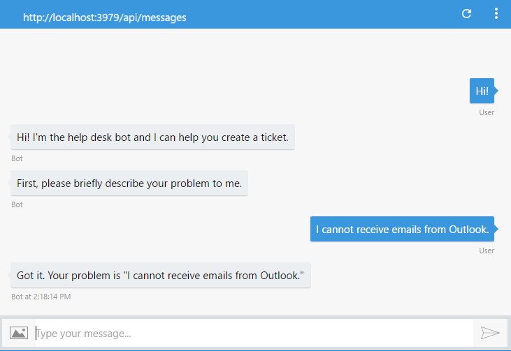
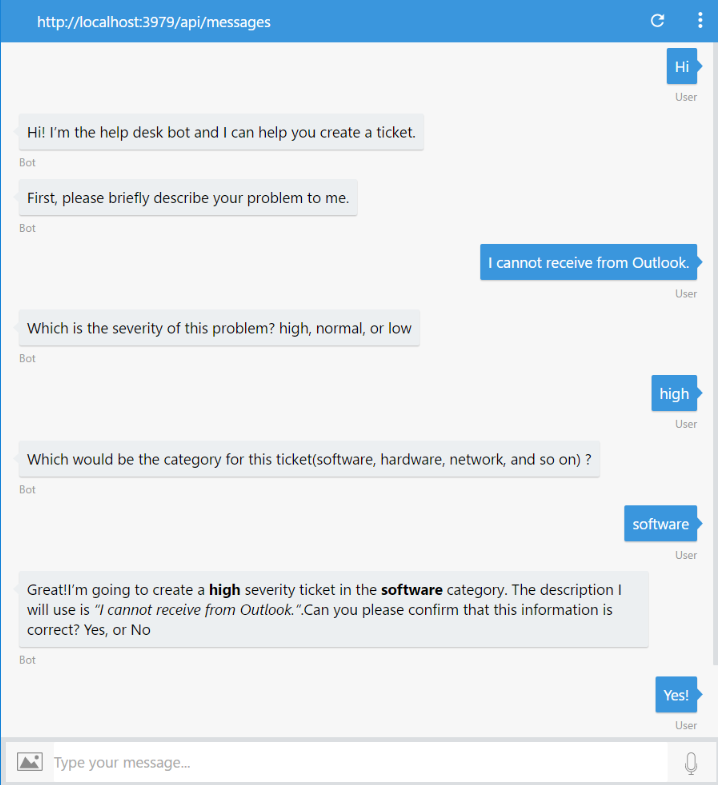
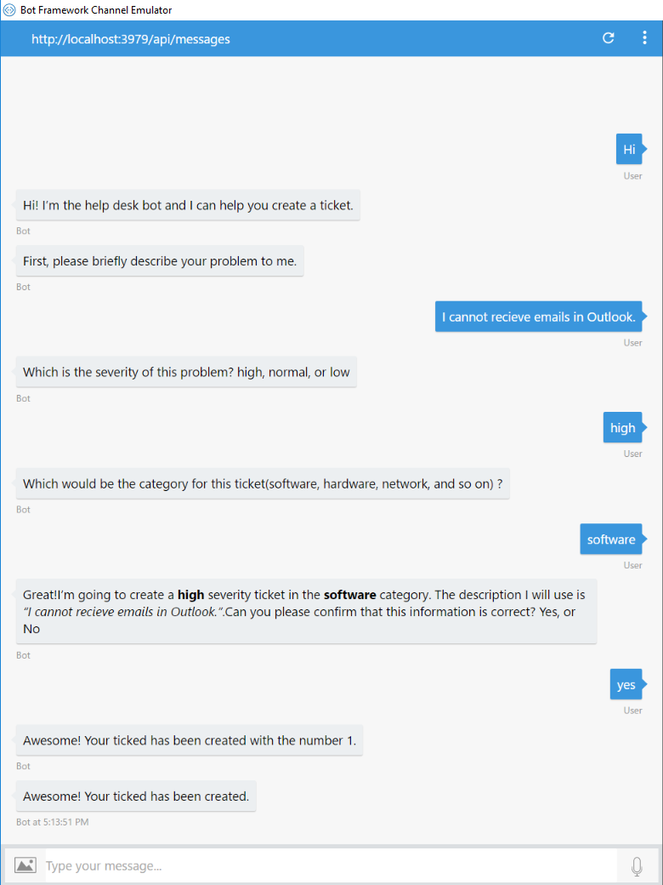
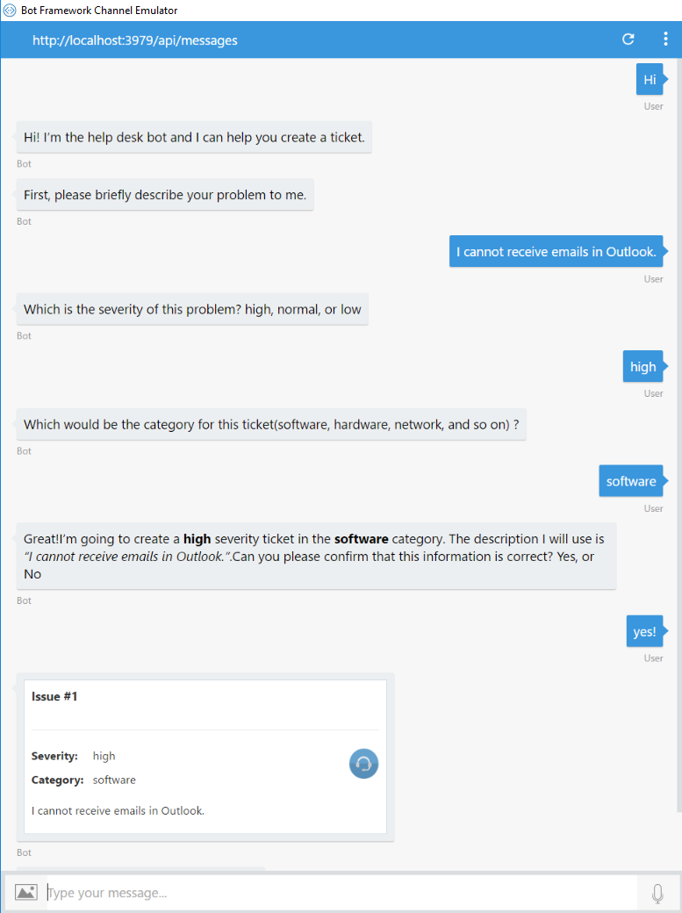

# Exercise 2: Submitting Help Desk Tickets with the Bot (C#)

## Introduction

In this exercise you will learn how to add conversation abilities to the bot to guide the user to create a help desk ticket.

Inside [this folder](./exercise2-TicketSubmissionDialog) you will find a solution with the code that results from completing the steps in this exercise. You can use this solutions as guidance if you need additional help as you work through this exercise. Remember that before using it, you first need to build it by using Visual Studio.

## Prerequisites

The following software is required for completing this exercise:

* Visual Studio 2017 for Windows. You can use it for free by downloading the [Visual Studio 2017 Community](https://www.visualstudio.com/downloads/) edition.
* The [Bot Framework Emulator](https://emulator.botframework.com/)

## Task 1: Adding Conversation to the Bot

In this task you will modify the bot code to ask the user a sequence of questions before performing some action.

1. Open the **Dialogs\RootDialog.cs** file you've obtained from the previous exercise. Alternatively, you can open the file from the [exercise1-EchoBot](./exercise1-EchoBot) folder.

1. Add the following variables at the beginning of the `RootDialog` class. We will use them later to store the user answers.

    ```csharp
    private string category;
    private string severity;
    private string description;
    ```

1. Replace the method `MessageReceivedAsync` with the following code.

    ```csharp
    public async Task MessageReceivedAsync(IDialogContext context, IAwaitable<IMessageActivity> argument)
    {
        var message = await argument;
        await context.PostAsync("Hi! I’m the help desk bot and I can help you create a ticket.");
        PromptDialog.Text(context, this.DescriptionMessageReceivedAsync, "First, please briefly describe your problem to me.");
    }

    public async Task DescriptionMessageReceivedAsync(IDialogContext context, IAwaitable<string> argument)
    {
        this.description = await argument;
        await context.PostAsync($"Got it. Your problem is \"{this.description}\"");
        context.Done<object>(null);
    }
    ```

    You will notice the Dialog implementation consist of a set of methods that are connected together using either the [conversation flow control](https://docs.microsoft.com/en-us/bot-framework/dotnet/bot-builder-dotnet-manage-conversation-flow#a-iddialog-lifecyclea-dialog-lifecycle) methods (provided by the `IDialogContext` interface) or some of the `PromptDialog` helper methods which also use the `IDialogContext` methods behind the scene to manage the conversation flow.

    When the conversation first starts, the dialog does not contain state, so the `Conversation.SendAsync` constructs `RootDialog` and calls its `StartAsync` method. The `StartAsync` method calls `IDialogContext.Wait` with the continuation delegate to specify the method that should be called when a new message is received (in this case is the `MessageReceivedAsync` method).

    The `MessageReceivedAsync` method waits for a message, which once received, it posts a response greeting the user and use `PromptDialog.Text()` to prompt him to describe the problem first. The SDK provides a set of built-in prompts to simplify collecting input from a user.

    Also, as response is persisted in the dialog instance -which was marked as `[Serializable]`- the framework is able to persist information for a single dialog instance. This is essential for storing temporary information in between the steps of the dialog.

1. Run the solution in Visual Studio (click the **Run** button) and open the emulator. Type the bot URL as usual (`http://localhost:3979/api/messages`) and test the bot as show below.

    

## Task 2: Prompting for All the Tickets Details

In this task you are going to add more message handlers to the bot code to prompt for all the ticket details.

1. Update the `DescriptionMessageReceivedAsync` to store the description the user entered and prompt the ticket's severity with the following code using the `PromptDialog.Choice` method which will give the user a set of choices where to pick one option.

    ``` csharp
    public async Task DescriptionMessageReceivedAsync(IDialogContext context, IAwaitable<string> argument)
    {
        this.description = await argument;
        var severities = new string[] { "high", "normal", "low" };
        PromptDialog.Choice(context, this.SeverityMessageReceivedAsync, severities, "Which is the severity of this problem?", null, 3, PromptStyle.AutoText);
    }
    ```

1. Next, add the `SeverityMessageReceivedAsync` method that receives the severity from the user and prompt to enter the category using the `PromptDialog.Text` method.

    ``` csharp
    public async Task SeverityMessageReceivedAsync(IDialogContext context, IAwaitable<string> argument)
    {
        this.severity = await argument;
        PromptDialog.Text(context, this.CategoryMessageReceivedAsync, "Which would be the category for this ticket(software, hardware, network, and so on) ?");
    }
    ```

1. Add the `CategoryMessageReceivedAsync` which store the category and prompt the user to confirm the ticket creation using the `PromptDialog.Confirm` method.

    ``` csharp
    public async Task CategoryMessageReceivedAsync(IDialogContext context, IAwaitable<string> argument)
    {
        this.category = await argument;
        var text = $"Great!I'm going to create a **{this.severity}** severity ticket in the **{this.category}** category. " +
                    $"The description I will use is _\"{this.description}\"_.Can you please confirm that this information is correct?";

        PromptDialog.Confirm(context, this.IssueConfirmedMessageReceivedAsync, text, null, 3, PromptStyle.AutoText);
    }
    ```

    > **NOTE:** Notice that you can use Markdown syntax to create richer text messages. However it's important to note that not all channels themselves support Markdown.

1. Add the method which handle the response for the confirm message with the following code.

    ``` csharp
    public async Task IssueConfirmedMessageReceivedAsync(IDialogContext context, IAwaitable<bool> argument)
    {
        var confirmed = await argument;

        if (confirmed)
        {
            await context.PostAsync("Awesome! Your ticked has been created.");
        }
        else
        {
            await context.PostAsync("Ok. The ticket was not created. You can start again if you want.");
        }
        context.Done<object>(null);
    }
    ```

1. Re-run the app and use the 'Start new conversation' button of the emulator . Test the new conversation.

    

    > **NOTE:** At this point if you talk to the bot again, the dialog will start over.

## Task 3: Calling an External API to Save the Ticket

At this point you have all the information for the ticket, however that information is discarded when the dialog ends. You will now add the code to create the ticket using an external API. For simplicity purposes, you will use a simple endpoint that saves the ticket into an in-memory array. In the real world, you can use any API that is accessible from your bot's code.

> **Note** One important fact about bots to keep in mind is most bots you will build will be a front end to an existing API. Bots are simply apps, and they do not require artificial intelligence (AI), machine learning (ML), or natural language processing (NLP), to be considered a bot.

1. Create a new controller named **TicketsController.cs** in the _Controllers_ folder. Replace the default content with the following code (keep the namespace section) which will handles the **POST** request to the `api/tickets` endpoint, adds the ticket to an array and response with the _issue id_ created:

    ``` csharp
    using System;
    using System.Collections.Generic;
    using System.Web.Http;
    using Model;

    public class TicketsController : ApiController
    {
        private static int nextIssueId = 1;
        private static Dictionary<int, Ticket> issues = new Dictionary<int, Ticket>();

        [HttpPost]
        public IHttpActionResult Post(Ticket issue)
        {
            int issueId;

            Console.WriteLine("Ticket accepted: category:" + issue.Category + " severity:" + issue.Severity + " description:" + issue.Description);

            lock (issues)
            {
                issueId = nextIssueId++;
                TicketsController.issues.Add(issueId, issue);
            }

            return this.Ok(issueId.ToString());
        }
    }
    ```

1. Add a new folder named `Util` in your project's root folder. At the new folder, add a new file named `TicketAPIClient.cs` which will call to the Ticket endpoint from the Bot. Update the default content with the following code (keep the namespace section) which creates a `HttpClient` and send a POST to the previously created endpoint and return the response from the endpoint.

    ```csharp
    using System;
    using System.Net.Http;
    using System.Net.Http.Headers;
    using System.Threading.Tasks;
    using System.Web.Configuration;
    using Exercise2.Model;

    public class TicketAPIClient
    {
        public async Task<int> PostTicketAsync(string category, string severity, string description)
        {
            try
            {
                using (var client = new HttpClient())
                {
                    client.BaseAddress = new Uri(WebConfigurationManager.AppSettings["TicketsAPIBaseUrl"]);
                    client.DefaultRequestHeaders.Accept.Add(new MediaTypeWithQualityHeaderValue("application/json"));

                    var ticket = new Ticket
                    {
                        Category = category,
                        Severity = severity,
                        Description = description
                    };

                    var response = await client.PostAsJsonAsync("api/tickets", ticket);
                    return await response.Content.ReadAsAsync<int>();
                }
            }
            catch
            {
                return -1;
            }
        }
    }
    ```

1. Update your `Web.Config` file in your project's root folder adding the key **TicketsAPIBaseUrl** under the **appSettings** section. This key will contain the Base URL wherever the Ticket endpoint will run. For the sake of this sample, is the same URL than the bot. But note that in a real world project it may be different URLs.

    ``` xml
    <add key="TicketsAPIBaseUrl" value="http://localhost:3979/" />
    ```

1. Replace the content of the `IssueConfirmedMessageReceivedAsync` method in the `RootDialog.cs` to make the call of the **TicketAPIClient** as follows:

    ``` csharp
    public async Task IssueConfirmedMessageReceivedAsync(IDialogContext context, IAwaitable<bool> argument)
    {
        var confirmed = await argument;

        if (confirmed)
        {
            var api = new TicketAPIClient();
            var ticketId = await api.PostTicketAsync(this.category, this.severity, this.description);

            if (ticketId != -1)
            {
                await context.PostAsync($"Awesome! Your ticked has been created with the number {ticketId}.");
            }
            else
            {
                await context.PostAsync("Ooops! Something went wrong while I was saving your ticket. Please try again later.");
            }
            await context.PostAsync("Awesome! Your ticked has been created.");
        }
        else
        {
            await context.PostAsync("Ok. The ticket was not created. You can start again if you want.");
        }
        context.Done<object>(null);
    }
    ```

1. Re-run the app and use the _Start new conversation_ button of the emulator . Test the full conversation again to check that the ticket id is returned from the API.

    

## Task 4: Change notification message to show an Adaptive Card

In this task you will replace the confirmation message that is shown to the user later the ticket was submitted to a nicer message made with Adaptive Cards. Adaptive Cards are an open card exchange format enabling developers to exchange UI content in a common and consistent way. Card Authors (you) describe their content as a simple JSON object. That content can then be rendered natively inside a Host Application (Bot Framework channels), automatically adapting to the look and feel of the Host. You can obtain more info [here](http://adaptivecards.io/).

1. You will need to add the `Microsoft.AdaptiveCards` NuGet package. To achieve this you can do right click on your project's **References** folder in the _Solution Explorer_ and click _Manage NuGet packages_. Search for the `Microsoft.AdaptiveCards` and then click on the **Install** button. Or you can type in the **Packager Manager Console** `Install-Package Microsoft.AdaptiveCards`.

1. Open the **RootDialog.cs** in the _Dialogs_ folder. At the end of the file (inside the class) add the following code that creates the Adaptive card with its header containing the title with the _ticketID_, the body containing a `ColumnSet` with two columns: one for a `FactSet` with the _Severity_ and _Category_ and another with an icon, and the last section includes a description block with the ticket description.

    ``` csharp
    private AdaptiveCard CreateCard(int ticketId, string category, string severity, string description)
    {
        AdaptiveCard card = new AdaptiveCard();

        var headerBlock = new TextBlock()
        {
            Text = $"Issue #{ticketId}",
            Weight = TextWeight.Bolder,
            Size = TextSize.Large,
            Speak = $"<s>You've created a new issue #{ticketId}</s><s>We will contact you soon.</s>"
        };

        var columnsBlock = new ColumnSet()
        {
            Separation = SeparationStyle.Strong,
            Columns = new List<Column>
            {
                new Column
                {
                    Size = "1",
                    Items = new List<CardElement>
                    {
                        new FactSet
                        {
                            Facts = new List<AdaptiveCards.Fact>
                            {
                                new AdaptiveCards.Fact("Severity:", severity),
                                new AdaptiveCards.Fact("Category:", category),
                            }
                        }
                    }
                },
                new Column
                {
                    Size = "auto",
                    Items = new List<CardElement>
                    {
                        new Image
                        {
                            Url = "http://i.imgur.com/WPdnJg8.png",
                            Size = ImageSize.Small,
                            HorizontalAlignment = HorizontalAlignment.Right
                        }
                    }
                }
            }
        };

        var descriptionBlock = new TextBlock
        {
            Text = description,
            Wrap = true
        };

        card.Body.Add(headerBlock);
        card.Body.Add(columnsBlock);
        card.Body.Add(descriptionBlock);

        return card;
    }
    ```

1. Update the `IssueConfirmedMessageReceivedAsync` method to call this method when the ticket was successfully created as below.

    ``` csharp
    public async Task IssueConfirmedMessageReceivedAsync(IDialogContext context, IAwaitable<bool> argument)
    {
        var confirmed = await argument;

        if (confirmed)
        {
            var api = new TicketAPIClient();
            var ticketId = await api.PostTicketAsync(this.category, this.severity, this.description);

            if (ticketId != -1)
            {
                var message = context.MakeMessage();
                message.Attachments = new List<Attachment>
                {
                    new Attachment
                    {
                        ContentType = "application/vnd.microsoft.card.adaptive",
                        Content = CreateCard(ticketId, this.category, this.severity, this.description)
                    }
                };
                await context.PostAsync(message);
            }
            else
            {
                await context.PostAsync("Ooops! Something went wrong while I was saving your ticket. Please try again later.");
            }
            await context.PostAsync("Awesome! Your ticked has been created.");
        }
        else
        {
            await context.PostAsync("Ok. The ticket was not created. You can start again if you want.");
        }
        context.Done<object>(null);
    }
    ```

1. Re-run the app and use the _Start new conversation_ button of the emulator . Test the new conversation. You should see the submission confirmation message as follows.

    

## Further Challenges

If you want to continue working on your own you can try with these tasks:

* Send a welcome message to the bot relying on the conversationUpdate event, as explained [here](https://docs.microsoft.com/en-us/bot-framework/nodejs/bot-builder-nodejs-handle-conversation-events#greet-a-user-on-conversation-join).
* Send a typing indicator to the bot while it calls the Tickets API, as explained [here](https://docs.microsoft.com/en-us/bot-framework/nodejs/bot-builder-nodejs-send-typing-indicator).