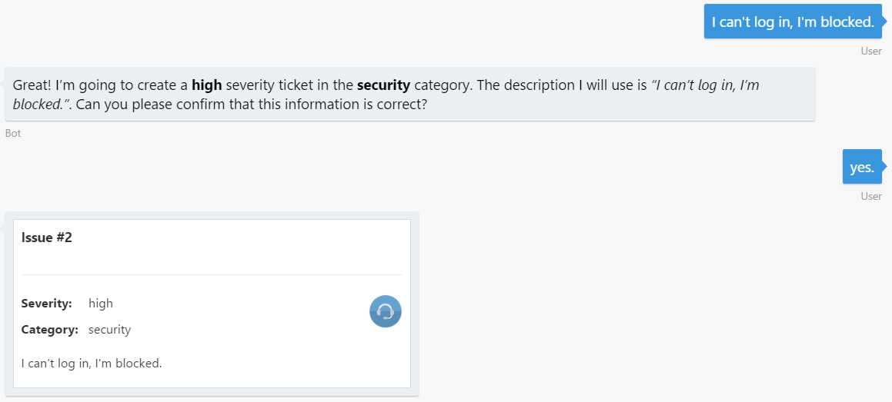
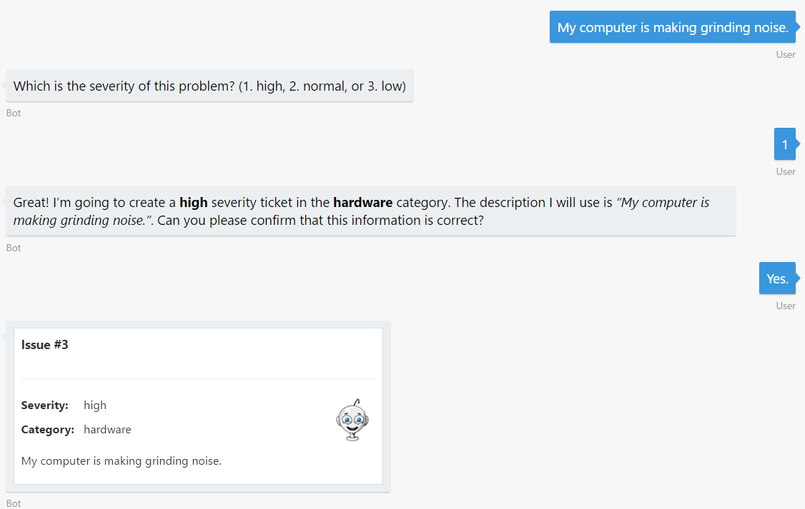
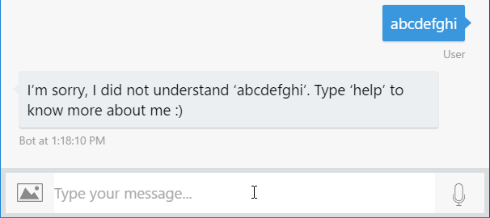

# Exercise 3: Making the Bot Smarter with Language Understanding (C#)

## Introduction

One of the key problems in human-computer interactions is the ability of the computer to understand what a person wants. LUIS is designed to enable developers to build smart applications that can understand human language and accordingly react to user requests.

In this exercise you will learn how to add natural language understanding abilities to the help desk bot to make it easier for users to create a ticket. To do this, you will use LUIS (Language Understanding Intelligent Service), part of the Azure Cognitive Services offering, which allow developers to build language models to allow a bot to understand commands and act accordingly. For instance, while in the previous exercise the user had to enter the severity and category, in this one, both "entities" will try to be recognized from the user message.

Inside [this folder](./exercise3-LuisDialog) you will find a Visual Studio solution with the code that results from completing the steps in this exercise. You can use this solutions as guidance if you need additional help as you work through this exercise. Remember that before using it, you first need to build it by using Visual Studio.

## Prerequisites

The following software is required for completing this exercise:

* Install Visual Studio 2017 for Windows. You can build bots for free with [Visual Studio 2017 Community](https://www.visualstudio.com/downloads/)
* An [Azure](https://azureinfo.microsoft.com/us-freetrial.html?cr_cc=200744395&wt.mc_id=usdx_evan_events_reg_dev_0_iottour_0_0) Subscription
* The [Bot Framework Emulator](https://emulator.botframework.com/)
* An account in the [LUIS Portal](https://www.luis.ai)

## Task 1: Create the LUIS App

In this task you will create an app in the LUIS portal. If you are already familiar with LUIS, you can import the file `luis_model.json` located under the [data](./exercise3-LuisDialog/data) folder of this exercise into your account, train and publish the model and continue on task 4.

1. Navigate to the [LUIS Portal](https://www.luis.ai) and sign in. Open the **My apps** tab.

1. Click **New App**. In the dialog box, type an application **name** (for example _HelpDeskBot_). Select the _English_ **Culture**, if not already selected.

    

1. Choose a **Key to use**. You can use the _BoostrapKey_ that is created by default.

1. Click **Create**. You should see an empty LUIS app dashboard.

    

1. Save for later use the **App ID**.

1. Navigate to the **My keys** menu in the top of the page. Once you are there, save for later use the Programmatic API key you will find there.

    

## Task 2: Add New Entities to LUIS

In this task you will add entities to the LUIS app. This will allow the bot to understand the ticket category and severity from the issue description entered by the user. Entities are 'nouns' in your application’s domain. An entity represents a class including a collection of similar objects (places, things, people, events or concepts).

1. In the LUIS portal, click **Entities** in the left panel.

1. Click **Add custom entity**.

1. In the dialog that opens, type _category_ as the **Entity name**. Select _List_ as the **Entity type**. Click **Save**.

    

1. A new page is displayed in which you can add the possible values. To make this process faster, click the **Import Lists** link.

1. Browse for the **categories.json** file in the [assets](../assets) folder on the root of this hands-on lab. Once enabled click the **Import** button.

1. Repeat this process with a new entity named **severity** and populate it using the file named **severities.json** from the same location.

    

1. Now click on **Train & Test** in the left panel.

1. Click **Train Application** and wait a few seconds to complete. Whenever you make updates in your current model, you’ll need to train your app before testing and publishing it.

## Task 3: Add Intents and Utterances

Intents are the intentions or desired actions conveyed through the utterances (sentences). Intents match user requests with the actions that should be taken by your app. So, you must add intents to help your app understand user requests and react to them properly.

Utterances are sentences representing examples of user queries or commands that your application is expected to receive and interpret. You need to add example utterances for each intent in your app. LUIS learns from these utterances and your app is able to generalize and understand similar contexts. By constantly adding more utterances and labeling them, you are enhancing your application’s language learning experience.

You can read more information about intents [here](https://docs.microsoft.com/en-us/azure/cognitive-services/LUIS/add-intents) and about utterances [here](https://docs.microsoft.com/en-us/azure/cognitive-services/LUIS/add-example-utterances).

1. In the LUIS portal, click **Intents** in the left panel. You will notice there is already a _None_ intent present.

1. Click on *Add Intent* and a popup is shown. Type _SubmitTicket_ as the **Intent name** and click **Save**.

1. Now, let's add the following utterances in the text box. Press enter after each one. When the user types these sentences or similar ones, the LUIS app will assume the user is trying to submit a ticket. In the Bot Framework language, this is called _Intent_.
    * _I can't log in, I'm blocked._
    * _I cannot print and I need to do it urgently._
    * _I need to request a new RAS token._
    * _I need to reset my password ASAP._
    * _I cannot open a web page and my deadline is at risk._

    > **NOTE:** You can add as many utterances as you want. More utterances you add, the better your app will recognize the intent of the users. In this particular case, the utterances that can trigger the SubmitTicket are quite diverse (ranging from hardware to software problems), so it would be ideal that the bot is trained with a considerable amount of utterances before releasing it to production.

1. Click **Save** ().

1. Following the same steps as above, add a new `Help` Intent with the utterances _help_, _hi_ and _hello_.

    

    > **NOTE:** It's a good practice to add some utterances to the "None" Intent, even if it is different from other intents. Giving it training examples won't limit what text will trigger the "None" intent, but it will help the other Intents fire more accurately.

1. Train the app again as explained previously.

1. Open the **Intents** menu and click on the **SubmitTicket** intent. Check that the utterances have been recognized with the entities values.

    

1. Now you will publish the LUIS app to be able to use it from the bot. Click **Publish App** from the left menu.

1. Make sure an *Endpoint key* is selected. Leave the default _Production_ slot.

1. Click on the **Publish** button. After a new confirmation message appears, the LUIS's app is now published.

    Notice that the output of a LUIS app is a web service with an HTTP endpoint that you reference from your client application to add natural language understanding to it.

    > **NOTE:** The LUIS service has 10,000 transactions free per month.

## Task 4: Update the Bot to Use LUIS

In this task you will update the bot code to use the LUIS app created previously.

1. Open the **Dialogs\RootDialog.cs** file you've obtained from the previous exercise. Alternatively, you can open the file from the [exercise2-TicketSubmissionDialog](./exercise2-TicketSubmissionDialog) folder.

1. Add namespaces using `Microsoft.Bot.Builder.Luis` and `Microsoft.Bot.Builder.Luis.Models`. Add the Attribute `LuisModel` to class as follows. Replace the `{LUISAppID}` with the App ID your have saved from the LUIS Portal and the `{LUISKey}` with the Programmatic API Key you have saved from _My Keys_ section.

    ```csharp
    [LuisModel("{LUISAppID}", "{LUISKey}")]
    ```

1. Replace the implementation of interface `IDialog` to derive from `LuisDialog<object>`. Remove `StartAsync`, `MessageReceivedAsync` and `DescriptionMessageReceivedAsync` methods since these will not be called anymore.

1. Within the class, create the `None` method that will execute when your LUIS model not matches a user's utterance to intent. To designate the method that will execute specify the `LuisIntent` attribute and pass the intent name as parameter.

    ``` csharp
    [LuisIntent("")]
    [LuisIntent("None")]
    public async Task None(IDialogContext context, LuisResult result)
    {
        await context.PostAsync($"I'm sorry, I did not understand {result.Query}.\nType 'help' to know more about me :)");
        context.Done<object>(null);
    }
    ```
1. Add the following code to handle the `Help` intent responding to the user with a message.

    ``` csharp
    [LuisIntent("Help")]
    public async Task Help(IDialogContext context, LuisResult result)
    {
        await context.PostAsync("I'm the help desk bot and I can help you create a ticket.\n" +
                                "You can tell me things like _I need to reset my password_ or _I cannot print_.");
        context.Done<object>(null);
    }
    ```

1. Add the following code which adds the method that handlers the intent _SubmitTicket_. Notice the `TryFindEntity` is used to determine if the entity is present in the utterance and if exists, extracts it.

    ``` csharp
    [LuisIntent("SubmitTicket")]
    public async Task SubmitTicket(IDialogContext context, LuisResult result)
    {
        EntityRecommendation categoryEntityRecommendation, severityEntityRecommendation;

        result.TryFindEntity("category", out categoryEntityRecommendation);
        result.TryFindEntity("severity", out severityEntityRecommendation);

        this.category = ((Newtonsoft.Json.Linq.JArray)categoryEntityRecommendation?.Resolution["values"])?[0]?.ToString();
        this.severity = ((Newtonsoft.Json.Linq.JArray)severityEntityRecommendation?.Resolution["values"])?[0]?.ToString();
        this.description = result.Query;

        await this.EnsureTicket(context);
    }
    ```

1. Next, create the `EnsureTicket` method which will validate if any entity was identified, if not prompt the user to enter the missing entities.

    ``` csharp
    private async Task EnsureTicket(IDialogContext context)
    {
        if (this.severity == null)
        {
            var severities = new string[] { "high", "normal", "low" };
            PromptDialog.Choice(context, this.SeverityMessageReceivedAsync, severities, "Which is the severity of this problem?", null, 3, PromptStyle.AutoText);
        }
        else if (this.category == null)
        {
            PromptDialog.Text(context, this.CategoryMessageReceivedAsync, "Which would be the category for this ticket(software, hardware, network, and so on) ?");
        }
        else
        {
            var text = $"Great!I'm going to create a **{this.severity}** severity ticket in the **{this.category}** category. " +
                    $"The description I will use is _\"{this.description}\"_.Can you please confirm that this information is correct?";

            PromptDialog.Confirm(context, this.IssueConfirmedMessageReceivedAsync, text, null, 3, PromptStyle.AutoText);
        }
    }
    ```

1. Update the `SeverityMessageReceivedAsync` and `CategoryMessageReceivedAsync` to call back to `EnsureTicket` method as follows.

    ``` csharp
    private async Task SeverityMessageReceivedAsync(IDialogContext context, IAwaitable<string> argument)
    {
        this.severity = await argument;
        await this.EnsureTicket(context);
    }
    ```

    ``` csharp
    private async Task CategoryMessageReceivedAsync(IDialogContext context, IAwaitable<string> argument)
    {
        this.category = await argument;
        await this.EnsureTicket(context);
    }
    ```

## Task 5: Test the Bot from the Emulator

1. Run the app clicking in the **Run** button. Type the bot URL as usual (`http://localhost:3979/api/messages`).

1. Type _hi_. Notice how the _Help_ intent is recognized and executed.

    

1. Type one of the utterances you used to train the bot. For example, _I can't log in, I'm blocked_. Notice that the ticket category and severity are automatically understood from the user message. Type _yes_ to save the ticket.

    

1. Now try typing something that the bot was not trained for. For example: _My computer is making a grinding noise_. Notice that the severity is not understood, but the category was because of the presence of the entity _computer_.

    

1. If you type something that the LUIS cannot recognize, LUIS will return the _None_ intent and the bot framework will execute the default dialog handler.

    

    Once your application is deployed and traffic starts to flow into the system, LUIS uses active learning to improve itself. In the active learning process, LUIS identifies the utterances that it is relatively unsure of, and asks you to label them according to intent and entities. In the LUIS portal, within an Intent, you will find the **Suggested Utterances** section, where you can do this.

    

## Further Challenges

If you want to continue working on your own you can try with these tasks:

* Add the ability to the bot to ask for the status of a ticket. You would need to add a status property to the ticket and a new Intent in the LUIS app that invokes a new dialog.