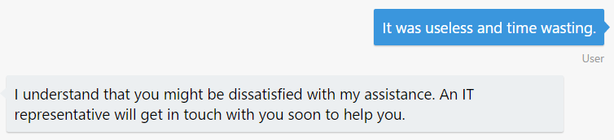

# Exercise 6: Determine the Sentiments Behind a User's Message (C#)

## Introduction

The interaction between users and bots is mostly free-form, so bots need to understand language naturally and contextually. In this exercise you will learn how to detect the user's sentiments and mood using the Azure Text Analytics API.

With [Text Analytics APIs](https://azure.microsoft.com/en-us/services/cognitive-services/text-analytics/), part of the Azure Cognitive Services offering, you can  detect sentiment, key phrases, topics, and language from your text. The API returns a numeric score between 0 and 1. Scores close to 1 indicate positive sentiment and scores close to 0 indicate negative sentiment. Sentiment score is generated using classification techniques.

Inside [this folder](./exercise6-MoodDetection) you will find a solution with the code that results from completing the steps in this exercise. You can use this solution as guidance if you need additional help as you work through this exercise.Remember that before using it, you first need to complete the placeholders in Web.config.

## Prerequisites

The following software is required for completing this exercise:

* [Visual Studio 2017 Community](https://www.visualstudio.com/downloads/) or higher
* An [Azure](https://azureinfo.microsoft.com/us-freetrial.html?cr_cc=200744395&wt.mc_id=usdx_evan_events_reg_dev_0_iottour_0_0) Subscription
* The [Bot Framework Emulator](https://emulator.botframework.com/)

## Task 1: Create the Text Analytics API Key

In this task you will create a Text Analytics Account.

1. Browse [here](https://azure.microsoft.com/en-us/try/cognitive-services/), select the **Language** tab. Find the *Text Analytics API* and click **Create**. You will be prompted to agree the terms of use and choose your country, next click **Next**.

1. Log in with your **Azure Subscription account**. You should be taken to a page like the following one with an evaluation key with 5000 free requests. Save Key 1 for later use.

    

## Task 2: Add the Text Analytics API Client

In this task you will create a new module to call the **Text Analytics API** from the bot.

1. Open the solution you've obtained from the previous exercise. Copy the [TextAnalyticsService.cs](../assets/csharp-mooddetection/Services/TextAnalyticsService.cs) in the **Services** folder.

    > **NOTE:** Notice that the client is hitting the `/sentiment` endpoint. The Text Analytics API also provides the `/keyPhrases` and `/languages` endpoints. Also notice that you can send more than one document to analyze.

1. Copy the [TextAnalyticsResult.cs](../assets/csharp-mooddetection/Model/TextAnalyticsResult.cs) in the **Model** folder. This class contains two classes which represents the **Text Analytics API**'s response.

1. Update your `Web.Config` file in your project's root folder adding the key **TextAnalyticsApiKey** under the **appSettings** section. Replace the `{YourTextAnalyticsKey}` placeholder with the **Text Analytics key** you've obtained in the previous task.

    ``` xml
    <add key="TextAnalyticsApiKey" value="{YourTextAnalyticsKey}" />
    ```
1. Copy the [UserFeedbackRequestDialog.cs](../assets/csharp-mooddetection/Dialogs/UserFeedbackRequestDialog.cs) in the **Dialogs** folder. This class contains a new dialog asking the user to provide feedback about help given (`StartAsync` method) and sends the response to the **Text Analytics** client recently created to evaluate the user sentiments (`MessageReciveAsync` method). Depending on the response (greater or lower than 0.5) a different message is displayed to the user.

    > **NOTE:** For sentiment analysis, it's recommended that you split text into sentences. This generally leads to higher precision in sentiment predictions.

## Task 3: Modify the Bot to Ask for Feedback and Analyze the User's Sentiments

1. Open the `RootDialog.cs` in the **Dialogs** folder and locate the `IssueConfirmedMessageReceivedAsync`. Update the affirmative block when asking if the user confirmed Ticket Submission and add at the end the following line to call the dialog that ask the user for feedback.

    ``` csharp
    context.Call(new UserFeedbackRequestDialog(), this.ResumeAndEndDialogAsync);
    ```

    Move the `context.Done<object>(null);` line inside the confirmed `else`. The resulting code should look as follows.

    ``` csharp
    private async Task IssueConfirmedMessageReceivedAsync(IDialogContext context, IAwaitable<bool> argument)
    {
        var confirmed = await argument;

        if (confirmed)
        {
            ...
            context.Call(new UserFeedbackRequestDialog(), this.ResumeAndEndDialogAsync);
        }
        else
        {
            ...
            context.Done<object>(null);
        }
    }
    ```

## Task 4: Test the Bot from the Emulator

1. Run the app clicking in the **Run** button and open the emulator. Type the bot URL as usual (`http://localhost:3979/api/messages`).

1. Type `I need to reset my password` and next choose a severity. Confirm the ticket submission, and check the new request for feedback.

    

1. Type `It was very useful and quick`. You should see the following response, which means it was a positive feedback.

    

1. Repeat the ticket submission and when the bot asks for feedback, type `it was useless and time wasting`. You should see a response as follows, which means it was a negative feedback.

    

    In the next exercise (7) you will learn how to hand-off the conversation to a human so he can assist the user.

## Further Challenges

If you want to continue working on your own you can try with these tasks:

* You can add Speech Recognition to the bot by using another Microsoft Cognitive Services. You can try the [Bing Speech API](https://azure.microsoft.com/en-us/services/cognitive-services/speech/).
