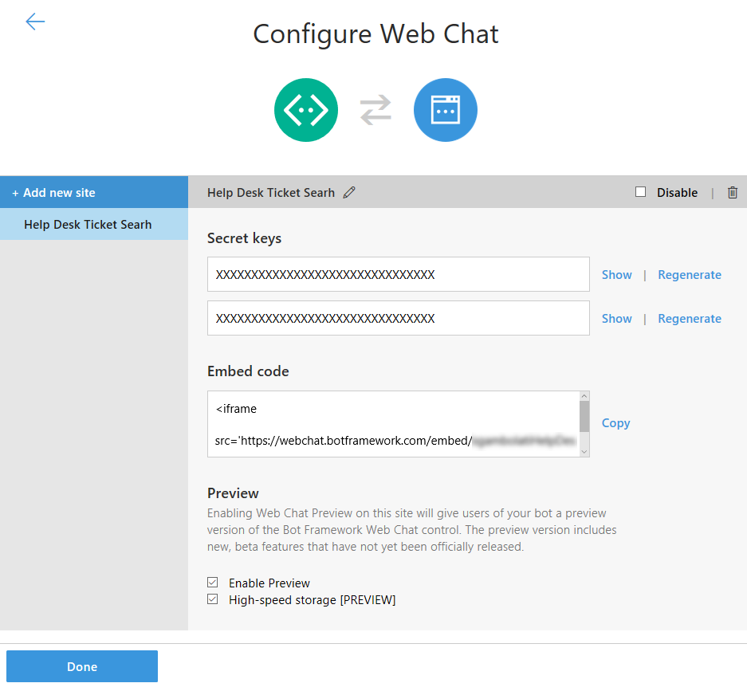

# Exercise 8: Send and Receive Events Through a Backchannel (C#)

## Introduction

The [open source Web Chat Control](https://github.com/Microsoft/BotFramework-WebChat) communicates with bots by using the [Direct Line API](https://docs.botframework.com/en-us/restapi/directline3/#navtitle), which allows `activities` to be sent back and forth between client and bot. The most common type of activity is `message`, but there are other types as well. For example, the activity type `typing` indicates that a user is typing or that the bot is working to compile a response.

You can use the backchannel mechanism to exchange information between client and bot without presenting it to the user by setting the activity type to `event`. The web chat control will automatically ignore any activities where `type="event"`.

Essentially the backchannel allows client and server to exchange any data needed, from requesting the client's time zone to reading a GPS location or what the user is doing on a web page. The bot can even guide the user by automatically filling out parts of a form and so on. The backchannel closes the gap between client JavaScript and bots.

In this exercise, the bot and web page will use the backchannel mechanism to exchange information that is invisible to the user. The bot will request that the web page show the knowledge base search results, and the web page will request that the bot show the detail of an article.

Inside [this folder](./exercise8-BackChannel) you will find a solution with the code that results from completing the steps in this exercise. You can use this solution as guidance if you need additional help as you work through this exercise. Remember that for using it, you first need to build it by using Visual Studio and complete the placeholders of the LUIS Model and Azure Search Index name and key in Web.config.

If you are not following all the exercises maybe you don't have already register your bot. To know how to register your bot, please refer to the [Exercise 5](./exercise5-Deployment.md).

## Prerequisites

The following software is required for completing this exercise:

* [Visual Studio 2017 Community](https://www.visualstudio.com/downloads/) or higher
* An [Azure](https://azureinfo.microsoft.com/us-freetrial.html?cr_cc=200744395&wt.mc_id=usdx_evan_events_reg_dev_0_iottour_0_0) subscription
* The [Bot Framework Emulator](https://emulator.botframework.com/) (make sure it's configured with the `en-US` Locale)
* Download [ngrok](https://ngrok.com/)

## Task 1: Add a New Site to your Bot's Web Chat Channel

1. Sign in to the [Bot Framework Portal](https://dev.botframework.com).

1. Click the **My bots** button and next click on your bot for editing it.

1. Click on the **Edit** () link for the _Web Chat_ channel. In the opened window, click **Add new site**. Enter a _site name_ (for example, _Help Desk Ticket Search_), Site name is for your reference and you can change it anytime.

    

1. Click **Done** and you may see a page as follow. Notice you have two **Secret Keys**. Safe for late use one of them. Click the **Done** button at page bottom.

    

## Task 2: Add HTML Page with an Embedded Web Chat

1. Open the app you've obtained from the previous exercise. Alternatively, you can use the app from the [exercise7-HandOffToHuman](./exercise7-HandOffToHuman) folder.
    > **NOTE:** If you use the solution provided remember to replace:
    > * the **[LuisModel("{LUISAppID}", "{LUISKey}")]** attribute placeholders in `RootDialog.cs` with your LUIS App Id and Programmatic API Key
    > * the **{TextAnalyticsApiKey}** in `Web.config` with your Text Analytics Key (as explained in exercise 6)
    > * the **{AzureSearchAccount}**, **{AzureSearchIndex}** and **{AzureSearchKey}** in `Web.config` with your search account, index name and key (as explained in exercise 4)

1. Replace the `default.htm` with [this template](../assets/exercise8-BackChannel/default.htm).

1. Bellow the [`botchat.js` script element](../assets/ -BackChannel/default.htm#L52) add a new script element with the following code boilerplate which creates a **DirectLine** object with the **Web Channel Secret**. Replace the `DIRECTLINE_SECRET` placeholder with your secret key from web-chat and the `BOT_ID` placeholder with the ID from your bot.

    ``` html
    <script>
        var botConnection = new BotChat.DirectLine({
            secret: 'DIRECTLINE_SECRET'
        });
        var resPanel = document.getElementById('results');

        BotChat.App({
            botConnection: botConnection,
            user: { id: 'WebChatUser' },
            bot: { id: 'BOT_ID' },
            locale: 'en-us',
        }, document.getElementById("bot"));
    </script>
    ```

1. In the same file add the code to catch the `searchResults` incoming events.

    ```javascript
    botConnection.activity$
        .filter(function (activity) {
            return activity.type === 'event' && activity.name === 'searchResults';
        })
        .subscribe(function (activity) {
            updateSearchResults(activity.value)
        });

    function updateSearchResults(results) {
        console.log(results);
        resPanel.innerHTML = ''; // clear
        results.forEach(function (result) {
            resPanel.appendChild(createSearchResult(result));
        });
    }

    function createSearchResult(result) {
        var el = document.createElement('div');
        el.innerHTML = '<h3>' + result.Title + '</h3>' +
            '<p>' + result.Text.substring(0, 140) + '...</p>';

        return el;
    }
    ```

## Task 3: Update your Bot to send `event` messages to Web Page

1. Open the `RootDialog` and add the `SendSearchToBackchannel` method to create and send the `searchResults` events via Back Channel.

    ```CSharp
    private async Task SendSearchToBackchannel(IDialogContext context, IMessageActivity activity, string textSearch)
    {
        var searchService = new AzureSearchService();
        var searchResult = await searchService.Search(textSearch);
        if (searchResult != null && searchResult.Value.Length != 0)
        {
            var reply = ((Activity)activity).CreateReply();

            reply.Type = ActivityTypes.Event;
            reply.Name = "searchResults";
            reply.Value = searchResult.Value;
            await context.PostAsync(reply);
        }
    }
    ```

1. Update the `SubmitTicket` method to call the new `SendSearchToBackchannel` method when the bot receive the ticket's description.

    ```CSharp
    [LuisIntent("SubmitTicket")]
    public async Task SubmitTicket(IDialogContext context, IAwaitable<IMessageActivity> activityWaiter, LuisResult result)
    {
        ...
        await this.EnsureTicket(context);

        await this.SendSearchToBackchannel(context, activity, this.description);
    }
    ```

## Task 4: Test Back channel from Bot to Web Page

1. Open a new console window where you've downloaded _ngrok_ and type `ngrok http 3979 -host-header="localhost"`. Notice that `3979` is the port number where your bot is running. Change if you are using another port number. Next, save for later use the Forwarding **https** URL.

    

1. Sign in to the [Bot Framework Portal](https://dev.botframework.com).

1. Click the **My bots** button and next click on your bot for editing it. Click on the **Settings** tab and update the _Messaging endpoint_ URL (remember to keep the `/api/messages`). Click in the **Save changes** button.

1. Run the app clicking in the **Run** button and open two instances of the emulator. Type the bot URL as usual (`http://localhost:3979/api/messages`) in both.

1. In a Web Browser, navigate to your bot URL (http://localhost:3978/ as usual). On the Web Chat Control, type `my computer is not working` in the Web Chat. You should see the list related articles in the right side of the page.

    

---
# WIP from here
## Task 3: Update Web Page to send `event` messages to your Bot

1. Open the `default.htm` file in the root folder for your solution. In the style section, replace the `#results h3` selector with the following CSS:

    ``` css
    #results h3 {
        margin-top: 0;
        margin-bottom: 0;
        cursor: pointer;
    }
    ```

1. Inside the `createSearchResult` function add a new event click to send a `showDetailsOf` event to the bot when the user clicks on the Title of any article.

    ```javascript
    el.getElementsByTagName('h3')[0]
        .addEventListener('click', function () {
            botConnection
                .postActivity({
                    type: 'event',
                    value: this.textContent.trim(),
                    from: { id: 'user' },
                    name: 'showDetailsOf'
                })
                .subscribe(function (id) {
                    console.log('event sent', id);
                });
        });
    ```

1. In the `MessagesController` add the following code to handle the `showDetailsOf` events.

    ```CSharp
    public class MessagesController : ApiController
    {
        private readonly AzureSearchService searchService = new AzureSearchService();

    ...
    ```

    ```CSharp
    private async Task HandleEventMessage(Activity message)
    {
        if (string.Equals(message.Name, "showDetailsOf", StringComparison.InvariantCultureIgnoreCase))
        {
            var searchResult = await this.searchService.SearchByTitle(message.Value.ToString());
            string reply = "Sorry, I could not find that article.";

            if (searchResult != null && searchResult.Value.Length != 0)
            {
                reply = searchResult.Value[0].Text;
            }

            // return our reply to the user
            Activity replyActivity = message.CreateReply(reply);

            ConnectorClient connector = new ConnectorClient(new Uri(message.ServiceUrl));
            await connector.Conversations.ReplyToActivityAsync(replyActivity);
        }
    }
    ```

1. Update the `Post` of the controller to send the `event` activities to the corresponding method.

    ```CSharp
    public async Task<HttpResponseMessage> Post([FromBody]Activity activity)
    {
        if (activity.Type == ActivityTypes.Message)
        {
            await Conversation.SendAsync(activity, () => new RootDialog());
        }
        else if (activity.Type == ActivityTypes.Event)
        {
            await this.HandleEventMessage(activity);
        }
        else
        {
            this.HandleSystemMessage(activity);
        }

        var response = Request.CreateResponse(HttpStatusCode.OK);
        return response;
    }
    ```

## Task 4: Test [BackChannel Event to conversation - it should match Node version]

1. [follow the same workflow from the last test]

1. [click in any title]

1. [see the magic]

## Further Challenges

[TBD]