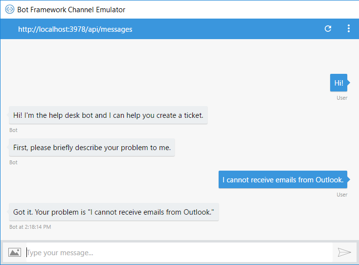
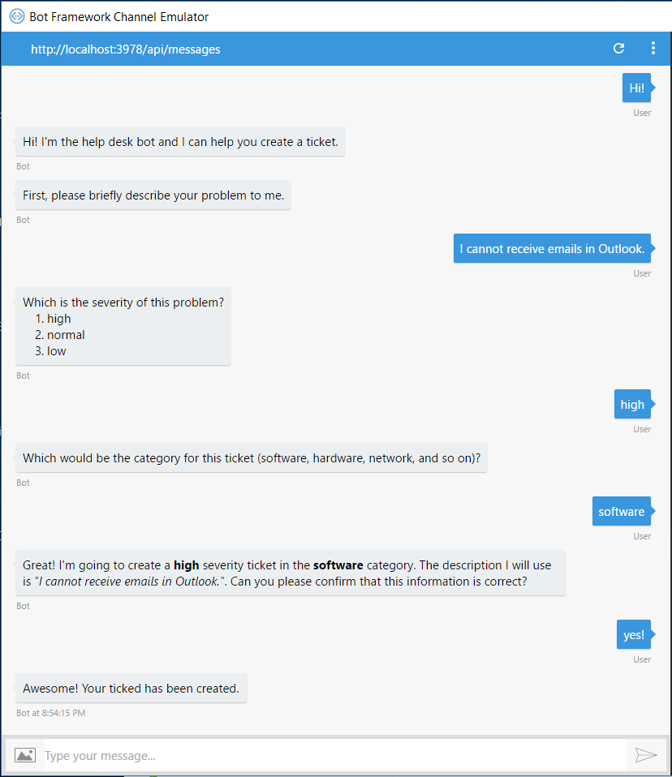
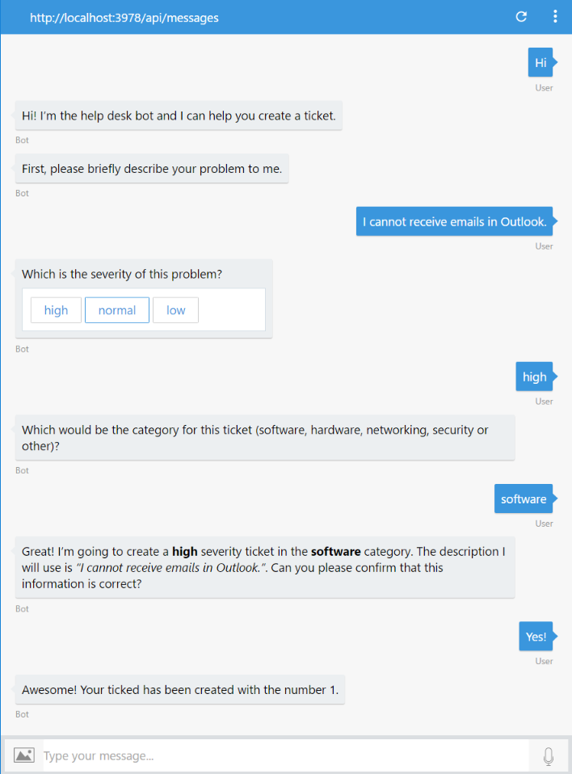
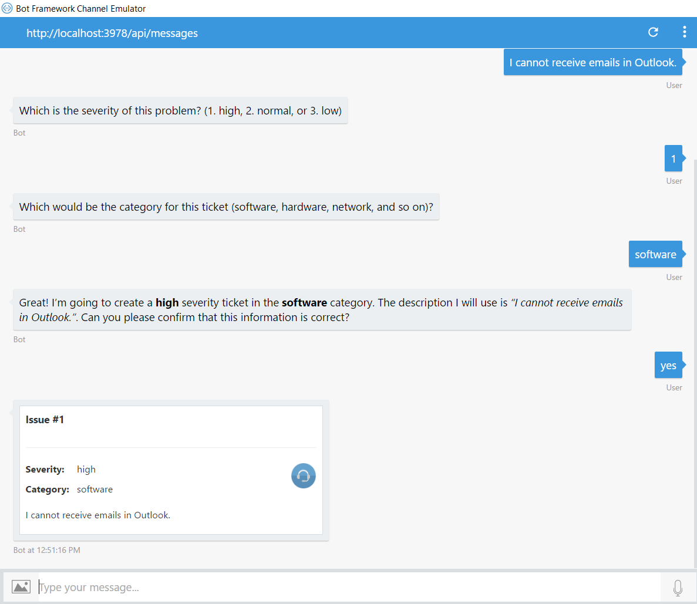

# Exercise 2: Submitting Help Desk Tickets with the Bot (Node.js)

## Introduction

In this exercise you will learn how to add conversation abilities to the bot to guide the user to create a help desk ticket.

Inside [this folder](./exercise2-TicketSubmissionDialog) you will find a solution with the code that results from completing the steps in this exercise. You can use this solutions as guidance if you need additional help as you work through this exercise. Remember that for using it, you first need to run `npm install`.

## Prerequisites

The following software is required for completing this exercise:

* [Latest Node.js with NPM](https://nodejs.org/en/download/)
* A code editor like [Visual Studio Code](https://code.visualstudio.com/download) or Visual Studio 2017 Community, Professional, or Enterprise
* The Bot Framework Emulator - download it from [here](https://emulator.botframework.com/)

## Task 1: Adding Conversation to the Bot

In this task you will modify the bot to ask the user a sequence of questions before performing some action.

1. Open the **app.js** file you've obtained from the previous exercise. Alternatively, you can open the file from the [exercise1-EchoBot](./exercise1-EchoBot) folder.

1. Update the code the creates the UniversalBot connector with the following. You will notice the bot's message handler takes an array of functions, called a waterfall, instead of a single function. When a user sends a message to our bot, the first function in the waterfall will be called. This will greet the user and use the `text()` prompt him to describe the problem first. The SDK provides a set of built-in prompts to simplify collecting input from a user.

    The user's response will be passed to the second function in the waterfall which will confirm the description. This cascading sequence of questions and responses is what gives the waterfall feature its name.

    Also, the response is persisted in dialog data, which is used to persist information for a single dialog instance. This is essential for storing temporary information in between the steps of a waterfall in a dialog.

    ```javascript
    var bot = new builder.UniversalBot(connector, [
        (session, args, next) => {
            session.send('Hi! I\'m the help desk bot and I can help you create a ticket.');
            builder.Prompts.text(session, 'First, please briefly describe your problem to me.');
        },
        (session, result, next) => {
            session.dialogData.description = result.response;
            session.send(`Got it. Your problem is "${session.dialogData.description}"`);
            session.endDialog();
        }
    ]);
    ```

1. Run the app from a console (`node app.js`) and open the emulator. Type the bot URL as usual (`http://localhost:3978/api/messages`) and test the bot.

    

1. You can also check in the console window how the message handlers are executed one after the other.

    

## Task 2: Prompting for All the Tickets Details

In this task you are going to add more message handlers to the bot waterfall to prompt for all the ticket details.

1. Update the code which creates the UniversalBot connector with the following. It introduces two new types of prompts:

    * `Prompts.choice()`: To prompt for the severity of the ticket.
    * `Prompts.confirm()`: To confirm that the ticket information is correct.


    ```javascript
    var bot = new builder.UniversalBot(connector, [
        (session, args, next) => {
            session.send('Hi! I\'m the help desk bot and I can help you create a ticket.');
            builder.Prompts.text(session, 'First, please briefly describe your problem to me.');
        },
        (session, result, next) => {
            session.dialogData.description = result.response;

            var choices = ['high', 'normal', 'low'];
            builder.Prompts.choice(session, 'Which is the severity of this problem?', choices);
        },
        (session, result, next) => {
            session.dialogData.severity = result.response.entity;

            builder.Prompts.text(session, 'Which would be the category for this ticket (software, hardware, networking, security or other)?');
        },
        (session, result, next) => {
            session.dialogData.category = result.response;

            var message = `Great! I'm going to create a **${session.dialogData.severity}** severity ticket in the **${session.dialogData.category}** category. ` +
                      `The description I will use is _"${session.dialogData.description}"_. Can you please confirm that this information is correct?`;

            builder.Prompts.confirm(session, message);
        },
        (session, result, next) => {
            if (result.response) {
                session.send('Awesome! Your ticked has been created.');
                session.endDialog();
            } else {
                session.endDialog('Ok. The ticket was not created. You can start again if you want.');
            }
        }
    ]);
    ```

    > **NOTE:** Notice that you can use Markdown syntax to create richer text messages. However it's important to note that not all channels themselves support Markdown.

1. Re-run the app and use the 'Start new conversation' button of the emulator . Test the new conversation.

    

    At this point if you talk to the bot again, the waterfall will start over.

## Task 3: Calling an External API to Save the Ticket

At this point you have all the information for the ticket, however that information is discarded when the waterfall ends. You will now add the code to create the ticket using an external API. For simplicity purposes, you will use a simple endpoint that saves the ticket into an in-memory array.

1. Create a new **ticketsApi.js** file in the root folder of the app and add the following code.

    ```javascript
    var tickets = [];
    var lastTicketId = 1;

    module.exports = (req, res) => {
        console.log('Ticket received: ', req.body);
        let ticketId = lastTicketId++;
        var ticket = req.body;
        ticket.id = ticketId;
        tickets.push(ticket);

        res.send(ticketId.toString());
    };
    ```

1. In the **app.js**, add the following require statement at the top of the file.

    ```javascript
    const ticketsApi = require('./ticketsApi');
    ```

1. Add the `listenPort` constant.

    ```javascript
    const listenPort = process.env.port || process.env.PORT || 3978;
    ```

1. Add the `ticketSubmissionUrl` constant.

    ```javascript
    const ticketSubmissionUrl = process.env.TICKET_SUBMISSION_URL || `http://localhost:${listenPort}`;
    ```

1. Update the `server.listen()` as show below.

    ```javascript
    server.listen(listenPort, '::', () => {
        console.log('Server Up');
    });
    ```

1. Add the json body parser and the Tickets API as shown below.

    ```javascript
    // Setup body parser and tickets api
    server.use(restify.bodyParser());
    server.post('/api/tickets', ticketsApi);
    ```

1. Replace the code of the last message handler with the following code that sends the dialogData to the Tickets API.

    ```javascript
    (session, result, next) => {

        if (result.response) {
            var data = {
                category: session.dialogData.category,
                severity: session.dialogData.severity,
                description: session.dialogData.description,
            }

            const client = restify.createJsonClient({ url: ticketSubmissionUrl });

            client.post('/api/tickets', data, (err, request, response, ticketId) => {
                if (err || ticketId == -1) {
                    session.send('Something went wrong while I was saving your ticket. Please try again later.')
                } else {
                    session.send(`Awesome! Your ticked has been created with the number ${ticketId}.`);
                }

                session.endDialog();
            });
        } else {
            session.endDialog('Ok. The ticket was not created. You can start again if you want.');
        }
    }
    ```
1. Re-run the app and use the 'Start new conversation' button of the emulator . Test the full conversation again to check that the ticket id is returned from the API.

    

## Task 4: Change notification message to show an Adaptive Card

In this task you will replace the confirmation message that is shown to the user later the ticket was submitted to a nicer message made with Adaptive Cards. Adaptive Cards are an open card exchange format enabling developers to exchange UI content in a common and consistent way. Card Authors (you) describe their content as a simple JSON object. That content can then be rendered natively inside a Host Application (Bot Framework channels), automatically adapting to the look and feel of the Host. You can obtain more info [here](http://adaptivecards.io/).

1. At the root folder for your code, create a folder named **cards**. In the new folder, copy the **ticket.json** file from the [assets/cards](../assets/cards) folder on the root of this hands-on lab.

1. Open the **app.js** file you've obtained from the previous task. Add the required `fs` module to access to the created file like follows at the _require_ code section.

    ```javascript
    const fs = require('fs');
    ```

1. At the end of the file, add the `createCard` function that will return the JSON file content, with some tokens replaced based on the parameters you pass to this function.

    ```javascript
    const createCard = (ticketId, data) => {
        var cardTxt = fs.readFileSync('./cards/ticket.json', 'UTF-8');

        cardTxt = cardTxt.replace(/{ticketId}/g, ticketId)
                        .replace(/{severity}/g, data.severity)
                        .replace(/{category}/g, data.category)
                        .replace(/{description}/g, data.description);

        return JSON.parse(cardTxt);
    };
    ```

1. Locate the last waterfall step, and replace the line 

    ```javascript
    session.send(`Awesome! Your ticked has been created with the number ${ticketId}.`);
    ```

    with this one

    ```javascript
    session.send(new builder.Message(session).addAttachment({
        contentType: "application/vnd.microsoft.card.adaptive",
        content: createCard(ticketId, data)
    }));
    ```

1. Re-run the app and use the 'Start new conversation' button of the emulator . Test the new conversation. You should see the submission confirmation message as follows.

    


## Further Challenges

If you want to continue working on your own you can try with these tasks:

* Send a welcome message to the bot relying on the conversationUpdate event, as explained [here](https://docs.microsoft.com/en-us/bot-framework/nodejs/bot-builder-nodejs-handle-conversation-events#greet-a-user-on-conversation-join).
* Send a typing indicator to the bot while it calls the Tickets API, as explained [here](https://docs.microsoft.com/en-us/bot-framework/nodejs/bot-builder-nodejs-send-typing-indicator).