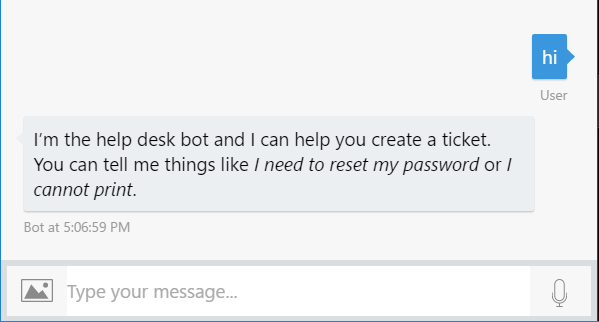
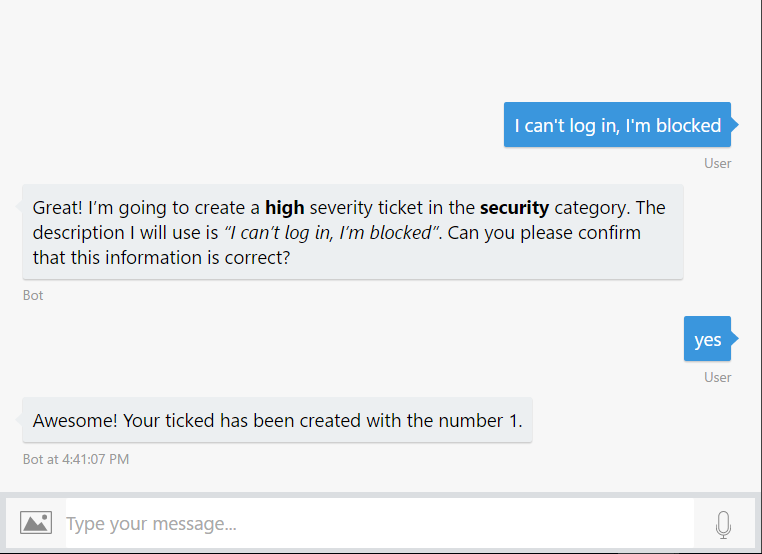
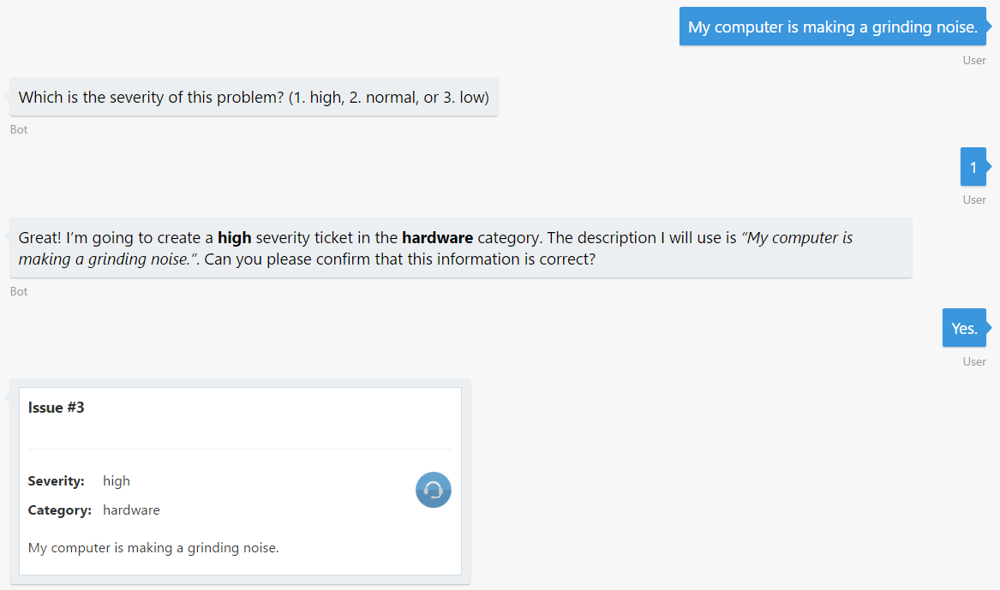

# Exercise 3: Making the Bot Smarter with Language Understanding - LUIS (Node.js)

## Introduction

In this exercise you will learn how to add natural language understanding abilities to the bot to enhance the user experience when creating a help desk ticket. Throughout this lab you will use LUIS (Language Understanding Intelligent Service), which is part of the Azure Cognitive Services offering. LUIS is designed to enable developers to build smart applications that can understand human language and accordingly react to user requests.

One of the key problems in human-computer interactions is the ability of the computer to understand what a person wants. LUIS is designed to enable developers to build smart applications that can understand human language and accordingly react to user requests. With LUIS, a developer can quickly deploy an HTTP endpoint that will take the sentences sent to it and interpret them in terms of their intents (the intentions they convey) and entities (key information relevant to the intent).

Inside [this folder](./exercise3-LuisDialog) you will find a solution with the code that results from completing the steps in this exercise. You can use this solutions as guidance if you need additional help as you work through this exercise. Remember that for using it, you first need to run `npm install`.

## Prerequisites

The following software is required for completing this exercise:

* [Latest Node.js with NPM](https://nodejs.org/en/download/)
* A code editor like [Visual Studio Code](https://code.visualstudio.com/download) or Visual Studio 2017 Community, Professional, or Enterprise
* An Azure Subscription - you can signup for a free trial [here](https://azureinfo.microsoft.com/us-freetrial.html?cr_cc=200744395&wt.mc_id=usdx_evan_events_reg_dev_0_iottour_0_0)
* The Bot Framework Emulator - download it from [here](https://emulator.botframework.com/)
* An account in the LUIS Portal [here](https://www.luis.ai)

## Task 1: Create the LUIS App

In this task you will create an app in the LUIS portal. If you are already familiar with LUIS, you can import the file `luis_model.json` located under the `./Node/exercise3-KnowledgeBase/data` folder of this hands-on lab into your account, train and publish the model and continue on task 4.

1. Navigate to the [LUIS Portal](https://www.luis.ai) and sign in. Open the **My apps** tab.

1. Click **New App**. In the dialog box, type an application name (for example **HelpDeskBot**). Select the **English** *Culture*, if not already selected.

    

1. Choose a **Key to use**. You can use the **BoostrapKey** that is created by default when you signed in.

1. Click on **Create**. You should see an empty LUIS app dashboard.

## Task 2: Add new Entities to LUIS

In this task you will add entities to the LUIS app. This will allow the bot to understand the ticket category and severity from the issue description entered by the user. Entities are 'nouns' in your application’s domain. An entity represents a class including a collection of similar objects (places, things, people, events or concepts).

1. In the LUIS portal, click **Entities** in the left panel.

1. Click on **Add custom entity**.

1. In the dialog that opens, type **category** as the entity name. Select **List** as the *Entity type*. Click *Save*.

    

1. A new page is displayed in which you can add the possible values. To make this process faster, click the *Import Lists* link.

1. Browse for the **categories.json** file in the **assets** folder in the root folder of this hands-on lab. Once enabled click the **Import** button.

1. Repeat this process with a new entity named **severity** and populate it using the file named **severities.json** from the same locations.

1. Now lick on **Train & Test** in the left panel.

1. Click on the *Train Application* and wait a few seconds to complete. Whenever you make updates in your current model, you’ll need to train your app before testing and publishing it.

## Task 3: Add Intents and Utterances

Intents are the intentions or desired actions conveyed through the utterances (sentences). Intents match user requests with the actions that should be taken by your app. So, you must add intents to help your app understand user requests and react to them properly. 

Utterances are sentences representing examples of user queries or commands that your application is expected to receive and interpret. You need to add example utterances for each intent in your app. LUIS learns from these utterances and your app is able to generalise and understand similar contexts. By constantly adding more utterances and labeling them, you are enhancing your application’s language learning experience. 

You can read more information about intents [here](https://docs.microsoft.com/en-us/azure/cognitive-services/LUIS/add-intents) and more info about utterances [here](https://docs.microsoft.com/en-us/azure/cognitive-services/LUIS/add-example-utterances).

1. In the LUIS portal, click **Intents** in the left panel. You will notice there is already a _None_ intent.

1. Click on *Add Intent* and a popup is shown. Type **SubmitTicket** as the *Intent name* and click **Save**.

1. Now, let's add the following utterances in the text box. Press enter after each one. When the user types these phrases or simmilar ones, the LUIS app will assume the user is trying to Submit a Ticket. It the bot framework language, this is called _Intent_.
    * _I can't log in, I'm blocked._
    * _I cannot print and I need to do it urgently._
    * _I need to request a new RAS token._
    * _I need to reset my password ASAP._
    * _I cannot open a web page and my deadline is at risk._

    > **NOTE:** You can add as many utterances as you want. More utterances you add, the better your app will recognize the intent of the users.

1. Click **Save**.

1. Following the same steps as above, now add a new `Help` Intent with the utterances _help_, _hi_ and _hello_.

1. Train the app again as explained previously.

1. Open the **Intents** menu and click on the **SubmitTicket** intent. Check that the utterances have been recognized with the entities values and now looks like as follows.

    

1. Now you will publish the LUIS app to be able to use it from the Bot. Open **Publish App**.

1. Make sure an *Endpoint key* is selected. Leave the default _Production_ slot.

1. Click on the **Publish** button. After a new confirmation message appears, the LUIS's app is now published. Copy and save for later use the *Endpoint url* generated.

    The output of a LUIS app is a web service with an HTTP endpoint that you reference from your client application to add natural language understanding to it.

## Task 4: Update the Bot to Use LUIS

In this task you will update the bot code to use the LUIS app created previously.

1. Open the **app.js** file you've obtained from the previous exercise. Alternatively, you can open the file from the [exercise2-TicketSubmission](./exercise2-TicketSubmission) folder.

1. Define a constant named luisModelUrl as follows, replacing the _{EndpointURL}_ placeholder with the value obtained from the previous task.

    ```javascript
    const luisModelUrl = process.env.LUIS_MODEL_URL || '{EndpointURL}';
    ```

1. Add the LUISRecognizer into your bot by adding this line after the bot initialization (`new builder.UniversalBot(...)`). Out of the box, Bot Builder comes with a LUISRecognizer class that can be used to call the machine learning model you’ve trained using the LUIS portal.

    ```javascript
    bot.recognizer(new builder.LuisRecognizer(luisModelUrl));
    ```

    > **NOTE:** Intent recognizers interpret the user’s intent based on user input. Once the intent has been determined, recognizers will return a named intent that can be used to trigger additional actions and dialogs within the bot. Be aware that the recognizer will run for every message received from the user.

Now you will refactor the waterfall steps from exercise 2 into new dialogs that will be triggered by the LUIS intents.

1. Register a new empty dialog named `SubmitTicket`. Like the bot initialization, we can pass to the dialog the existing waterfall. Move the waterfall step in which the bot ask for severity, category and confirm the data entered and the last one which hit the ticket API.
You must have a similiar code block as follow.

    ```javascript
    bot.dialog('SubmitTicket', [
       
    ])
    .triggerAction({
        matches: 'SubmitTicket'
    });
    ```

    > **NOTE:** Notice that the `matches` value should match the name of the Intent in the LUIS app.

1. Move all the Waterfall steps from the UniversalBot initialization into the `SubmitTicket` new Dialog. Replace the code with the following.

    ```javascript
    var bot = new builder.UniversalBot(connector, (session) => {
        session.send(`I'm sorry, I did not understand '${session.message.text}'.\nType 'help' to know more about me :)`);
    });
    ``` 

1. Now retrieve the entities values for *category* and *severity* from LUIS and store them in the `dialogData` for later use. Finally, if the severity is already setted, we call the next step otherwise prompt the user to choice one. To do this, replace the first waterfall step with the following code.

    ```javascript
    ...
    (session, args, next) => {
        var category = builder.EntityRecognizer.findEntity(args.intent.entities, 'category');
        var severity = builder.EntityRecognizer.findEntity(args.intent.entities, 'severity');

        if (category && category.resolution.values.length > 0) {
            session.dialogData.category = category.resolution.values[0];
        }

        if (severity && severity.resolution.values.length > 0) {
            session.dialogData.severity = severity.resolution.values[0];
        }

        session.dialogData.description = session.message.text;

        if (!session.dialogData.severity) {
            var choices = ['high', 'normal', 'low'];
            builder.Prompts.choice(session, 'Which is the severity of this problem?', choices);
        } else {
            next();
        }
    },
    ...
    ```

    > **NOTE:** Notice that we changed the parameter *result* to *args*.

1. Update the code receive and save the severity of the ticket. If the category is already understood the next step is called, otherwise the bot prompts the user to type it. To do this, replace the second and third waterfall steps with the following code. The fourth and fifth waterfall steps should remain unchanged.

    ```javascript
    ...
    (session, result, next) => {
        if (!session.dialogData.severity) {
            session.dialogData.severity = result.response.entity;
        }

        if (!session.dialogData.category) {
            builder.Prompts.text(session, 'Which would be the category for this ticket (software, hardware, network, and so on)?');
        } else {
            next();
        }
    },
    ...
    ```

1. Add the following `if` in the third waterfall.

    ```javascript
    if (!session.dialogData.category) {
        session.dialogData.category = result.response;
    }
    ```

1. Finally create a new dialog that will be executed when the user writes the message `help`.

    ```javascript
    bot.dialog('Help',
        (session, args, next) => {
            session.send(`I'm the help desk bot and I can help you create a ticket.\n` +
                `You can tell me things like _I need to reset my password_ or _I cannot print_.`);
        }
    ).triggerAction({
        matches: 'Help'
    });
    ```

## Task 5: Test the Bot From the Emulator

1. Run the app from a console (`node app.js`) and open the emulator. Type the bot URL as usual (`http://localhost:3978/api/messages`).

1. Type _hi_.

    

1. Type one of the utterances you used to train the bot. For example, _I can't log in, I'm blocked_. Notice that the ticket category and severity are automatically understood from the user message. Type yes to save the ticket.

    

1. Now try typing something that the bot was not trained for. For example: _My computer is making a grinding noise._. Notice that the severity is not understood, but the category was because of the presence of the entity _computer_. 

    

Once your application is deployed and traffic starts to flow into the system, LUIS uses active learning to improve itself. In the active learning process, LUIS identifies the utterances that it is relatively unsure of, and asks you to label them according to intent and entities. In the LUIS portal, within an Intent, you will find the **Suggested Utterances** section.