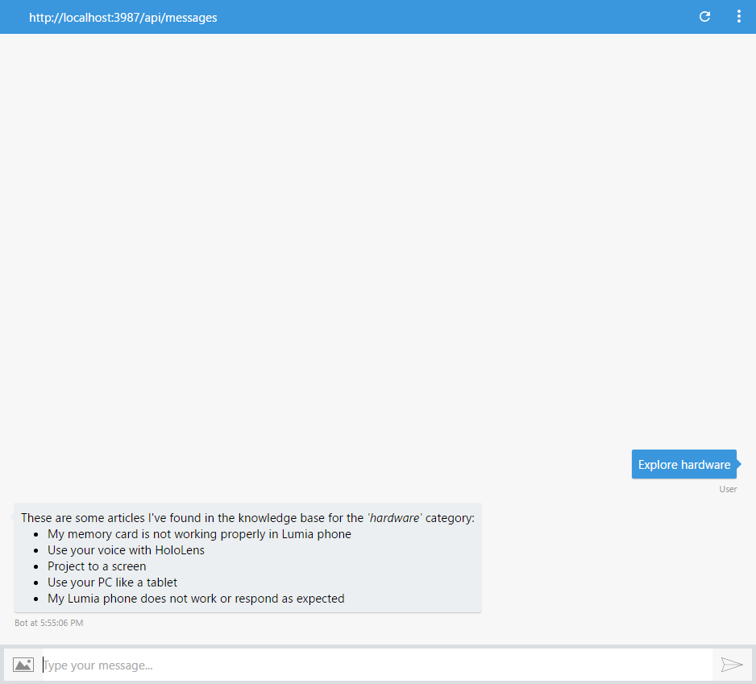
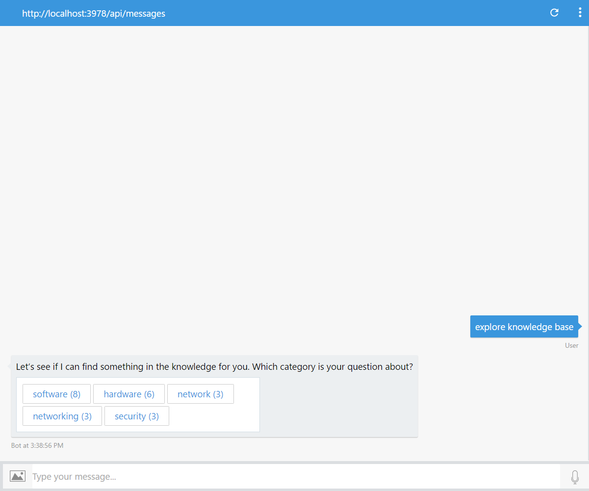
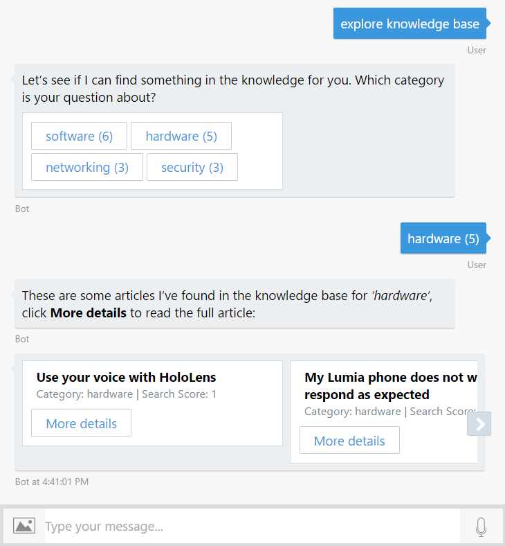
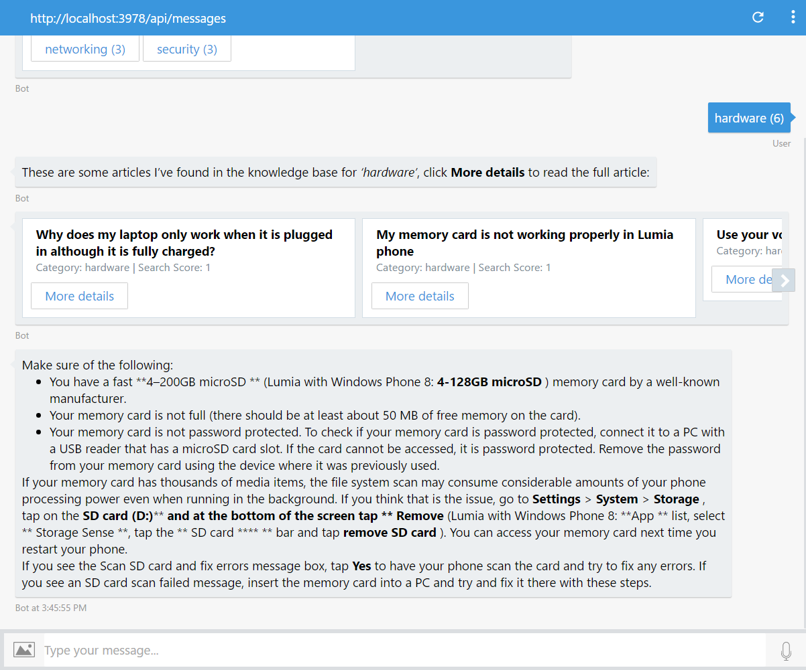
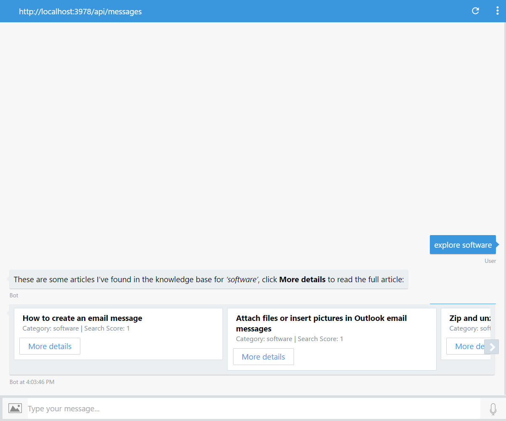
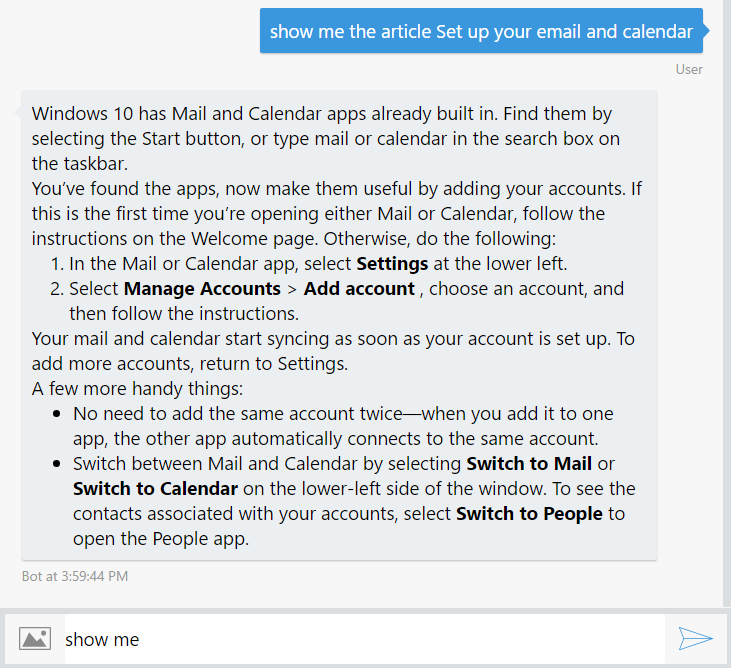

# Exercise 4: Implementing a Help Desk Knowledge Base with Azure Search and DocumentDB (Node.js)

## Introduction

In this exercise you will learn how to help users navigate a knowledge base by using the bot.

[Azure Search](https://azure.microsoft.com/en-us/services/search/) is a service that offers most of the needed pieces of functionality for Search capabilities, including keyword search, built-in linguistics, custom scoring, faceted navigation and more. Azure Search can also index content from various sources (Azure SQL DB, DocumentDB, Blob Storage, Table Storage), supports "push" indexing for other sources of data, and can crack open PDFs, Office documents and other formats containing unstructured data. The content catalog goes into an Azure Search index, which we can then query from dialogs.

Inside [this folder](./exercise4-KnowledgeBase) you will find a solution with the code that results from completing the steps in this hands-on lab. You can use this solutions as guidance if you need additional help as you work through this hands-on lab. Remember that for using it, you first need to run `npm install`.

## Prerequisites

The following software is required for completing this hands-on lab:

* [Latest Node.js with NPM](https://nodejs.org/en/download/)
* A code editor like [Visual Studio Code](https://code.visualstudio.com/download) or Visual Studio 2017 Community, Professional, or Enterprise
* An Azure Subscription - you can signup for a free trial [here](https://azureinfo.microsoft.com/us-freetrial.html?cr_cc=200744395&wt.mc_id=usdx_evan_events_reg_dev_0_iottour_0_0)
* Creating an account in the LUIS Portal [here](https://www.luis.ai)
* The Bot Framework Emulator - download it from [here](https://emulator.botframework.com/)

## Task 1: Create a Document DB Service and Upload the Knowledge Base

In this task you will create a DocumentDB database and upload some documents that will be consumed by your bot. You can learn more about Document DB Concepts [here]( https://docs.microsoft.com/en-us/azure/documentdb/documentdb-resources).

1. Navigate to [Azure portal](https://portal.azure.com) and sign in. Click on **New** button on the left bar, next on *Databases* and then choose **NoSQL (DocumentDB)** / **Azure Cosmos DB** and click on the *Create* button.

1. In the dialog box, type a *account ID* of your choice and ensure **NoSQL API** is selected in *DocumentDB* / **SQL (MongoDB)** in *API*. Click on *Create*.

    

1. Open the previously created *DocumentDB account* and navigate to the *Overview* section. Click on the *Add Collection* button. In the dialog box, type **knowledge-base** on *Collection Id* and **knowledge-base-db** on *new Database*. Click on the *OK* button.

    

1. Click on the *Document Explorer* on the left, and next click on the *Upload* button.

1. On the opened window pick up all the files in the **assets/kb** folder. Click on the *Upload* button. You may see something like follows. 

## Task 2: Create the Azure Search Service

In this task you will create an Azure Search Service related with the DocumentDB created in the previous task.

1. Sign in on [Azure portal](https://portal.azure.com) if you aren't there already. Click on **New** button on the left bar, next on *Web + Mobile* and then choose *Azure Search* and click on the *Create* button. In the Type some descriptive service name on the *URL*. Ensure you have selected a *Subscription*, *Resource Group*, *Location* and *Price Tier* and click on the *Create* button.

    

1. Navigate to the *Overview* and then click on the *Data Source - Import data* button.

1. Click on the *Connect to your data* button and *DocumentDB* next. Enter **knowledge-base-datasource** on the data source *name*. Select your *DocumentDB Account* earlier created and then the *Database* list will populated with the one you just created. Select it and then the *Collection* is populated also. Complete selecting the collection. Click the *Ok* button.

    

1. Click on the *Index - Customize target index* button. Enter **knowledge-base-index** as *Index Name*. Ensure you have the index definition as follow. Click *Ok*.

    

1. Click on the *Indexer - Import your data* button. Enter **knowledge-base-indexer** as *Name*. Ensure **Once** is selected in the *Schedule*. Click *OK*.

    

1. Click *OK* again to accept the *Import Data*.

1. Click on *Settings\Keys* on the left. And next Click on *Manage query keys*. Save the default **Azure Search key** (identified by *&lt;empty&gt;* name) for future usage.

    

## Task 3: Create Azure Search API Client

In this task you will back to your code to create a new file that will interact with the *Azure Search* and also you will include it in the bot file.

1. Create a new file named **azureSearchApiClient.js** and paste the following code which will get the data from *Azure Search* via REST.
    
    ```javascript
    const restify = require('restify');
    
    module.exports = (config) => {
        return (query, callback) => {
            const client = restify.createJsonClient({ url: `https://${config.searchName}.search.windows.net/` });
            var urlPath = `/indexes/${config.indexName}/docs?api-key=${config.searchKey}&api-version=2015-02-28&${query}`;

            client.get(urlPath, (err, request, response, result) => {
                if (!err && response && response.statusCode == 200) {
                    callback(null, result);
                } else {
                    callback(err, null);
                }
            });
        };
    };
    ```

1. Open the app.js file you've obtained from the previous exercise. 

1. Update  **app.js** with the following code in the *require* section to instanciate the previous created module. Alternatively, you can open the file from the [exercise3-LuisDialog](./exercise3-LuisDialog) folder.

1. Define a constant named azureSearch, and another constant named azureSearchQuery as follow, replacing the *{AzureSearchAccountName}* with the Acount name of the Azure Search you created in task 2 and *{AzureSearchKey}* with the key value you obtain also in task 2.

    ```javascript
    const azureSearch = require('./azureSearchApiClient');

    const azureSearchQuery = azureSearch({
        searchName: process.env.AZURE_SEARCH_ACCOUNT || 'AzureSearchAccountName',
        indexName: process.env.AZURE_SEARCH_INDEX || 'knowledge-base-index',
        searchKey: process.env.AZURE_SEARCH_KEY || 'AzureSearchKey'
    });
    ```

## Task 4: Update the LUIS Model to Include the ExploreKnowledgeBase Intent

In this task you will add a new Intent to LUIS to handle the instruction to explorer the Knowledge Base you created in the Azure Portal.

1. Sign in on the [LUIS Portal](https://www.luis.ai/). Edit the App you created on Exercise 3.

1. Click on *Intents* on the left and next click on the *Add Intent* button, type **ExploreKnowledgeBase** as the *Intent name* and then add the following Utterances:
    
    * explore knowledge base

    * explore hardware
    
    * find me articles about hardware

1. Click on the *Save* button.

1. Click on the *Publish App* link on the left. Click on the *Train* button and when it finish, click on the *Publish* button.

## Task 5: Update the Bot to Display the Articles Categories Available in the Search Index

In this task you will add a dialog which will catch the *Intent* you just created and call *Azure Search* endpoint.

1. In the **app.js**, add the **ExploreKnowledgeBase** handler to retrieve the Facets, just after the *SubmitTicket* dialog.
    
    ```javascript
    bot.dialog('ExploreKnowledgeBase', [
        (session, args) => {
            var category = builder.EntityRecognizer.findEntity(args.intent.entities, 'category');
            if (!category) {
                return session.endDialog('Try typing something like _explore hardware_.');
            }
            // search by category
            azureSearchQuery('$filter=' + encodeURIComponent(`category eq '${category.entity}'`), (error, result) => {
                if (error) {
                    session.endDialog('Ooops! Something went wrong while contacting Azure Search. Please try again later.');
                } else {
                    var msg = `These are some articles I\'ve found in the knowledge base for the _'${category.entity}'_ category:`;
                    result.value.forEach((article) => {
                        msg += `\n * ${article.title}`;
                    });
                    session.endDialog(msg);
                }
            });
        }
    ]).triggerAction({
        matches: 'ExploreKnowledgeBase'
    });
    ```
## Task 6: Test your Bot at this Point

In this task you will test your changes after to move ahead.

1. Run the app from a console (`node app.js`) and open the emulator. Type the bot URL as usual (`http://localhost:3978/api/messages`).

1. Type *explore hardware*. Notice the list of articules with that *category* listed by your bot. You can also try with the remaining categories values you upload as LUIS entity list.

    

---

## Task 7: Update the Bot to Display the Article

In this task you will update your bot code to enable it to show the articles in the knowledge from exploring the Knowledge Base starting by its categories or requesting a specific category or article.

1. In the **app.js**, update the default dialog to perform a search.

    ```javascript
    var bot = new builder.UniversalBot(connector, (session) => {
        session.sendTyping();
        azureSearchQuery(`search=${encodeURIComponent(session.message.text)}`, (err, result) => {
            if (err) {
                session.send('Ooops! Something went wrong on my side, please try again later.');
                return;
            }
            session.replaceDialog('ShowKBResults', { result, originalText: session.message.text });
        });
    });
    ```
    
1. Add as the first step of the waterfall in **ExploreKnowledgeBase** dialog the next code that retrive the facets when the user doesn't provide a category in the intent and when the category is present it pass to the next step.

    ```javascript
    (session, args, next) => {
        var category = builder.EntityRecognizer.findEntity(args.intent.entities, 'category');

        if (!category) {
            // retrieve facets
            azureSearchQuery('facet=category', (error, result) => {
                if (error) {
                    session.endDialog('Ooops! Something went wrong while contacting Azure Search. Please try again later.');
                } else {
                    var choices = result['@search.facets'].category.map(item=> `${item.value} (${item.count})`);
                    builder.Prompts.choice(session, 'Let\'s see if I can find something in the knowledge for you. Which category is your question about?', choices, { listStyle: builder.ListStyle.button });
                }
            });
        } else {
            if (!session.dialogData.category) {
                session.dialogData.category = category.entity;
            }

            next();
        }
    },
    ```

1. Update the second waterfall step to take care about the stored data when the user send a category.

    ```javascript
    (session, args) => {
        var category;

        if (session.dialogData.category) {
            category = session.dialogData.category;
        } else {
            category = args.response.entity.replace(/\s\([^)]*\)/,'');
        }

        // search by category
        azureSearchQuery('$filter=' + encodeURIComponent(`category eq '${category}'`), (error, result) => {
            if (error) {
                session.endDialog('Ooops! Something went wrong while contacting Azure Search. Please try again later.');
            } else {
                session.replaceDialog('ShowKBResults', { result, originalText: category });
            }
        });
    }
    ```

1. Add the following code at the end of the **app.js** file that add the **DetailsOf** dialog. This dialog shows the specific article based in this title.

    ```javascript
    bot.dialog('DetailsOf', [
        (session, args) => {
            var title = session.message.text.substring('show me the article '.length);
            azureSearchQuery('$filter=' + encodeURIComponent(`title eq '${title}'`), (error, result) => {
                if (error || !result.value[0]) {
                    session.endDialog('Sorry, I could not find that article.');
                } else {
                    session.endDialog(result.value[0].text);
                }
            });
        }
    ]).triggerAction({
        matches: /^show me the article (.*)/
    });
    ```

1. Add the following code to add the **ShowKBResults** dialog. This dialog present to the user the result of the search.

    ```javascript
    bot.dialog('ShowKBResults', [
        (session, args) => {
            if (args.result.value.length > 0) {
                var msg = new builder.Message(session).attachmentLayout(builder.AttachmentLayout.carousel);
                args.result.value.forEach((faq, i) => {
                    msg.addAttachment(
                        new builder.HeroCard(session)
                            .title(faq.title)
                            .subtitle(`Category: ${faq.category} | Search Score: ${faq['@search.score']}`)
                            .text(faq.text.substring(0, Math.min(faq.text.length, 50) + '...'))
                            .buttons([{ title: 'More details', value: `show me the article ${faq.title}`, type: 'postBack' }])
                    );
                });
                session.send(`These are some articles I\'ve found in the knowledge base for _'${args.originalText}'_, click **More details** to read the full article:`);
                session.endDialog(msg);
            } else {
                session.endDialog(`Sorry, I could not find any results in the knowledge base for _'${args.originalText}'_`);
            }
        }
    ]);
    ```
## Task 8: Test the Bot from the Emulator

In this task you will test the latest changes you made to your bot.

1. Run your code and open the emulator pointing to your running bot.
1. Type `explore knowledge base` and send it to the bot and next you may see listed the categories you upload to DocumentDB. 

    

1. Click on any of the categories listed and you may see the articles for that category. 

    

1. Click on any of the articles listed you may see the detial of the articule.

    

1. You can try to explore a specific category. Type `explore software` and you may see the articles of that category.

    

1. You can try to show a specific category too. Type `show me the article Turn on device encryption` and you may see the requested article. (Please note the search is case sensitive)

    

## Further Challenges

If you want to continue working on your own you can try with these tasks:

    * TBD

    * TBD