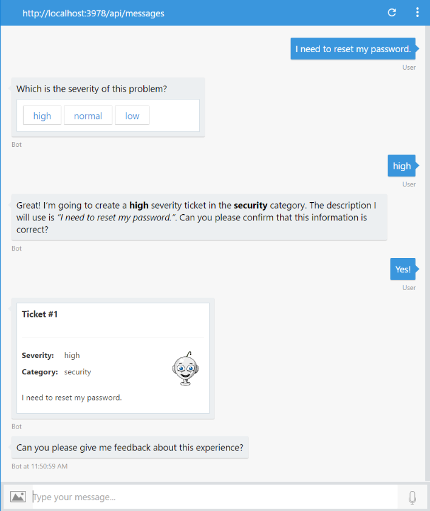

# Exercise 6: Determine the Mood Behind a User's Message (Node.js)

## Introduction

In this exercise you will learn how to detect the user's mood based on feedback provided.

With [Text Analytics APIs](https://azure.microsoft.com/en-us/services/cognitive-services/text-analytics/) you can  detect sentiment, key phrases, topics, and language from your text. The API returns a numeric score between 0 and 1. Scores close to 1 indicate positive sentiment and scores close to 0 indicate negative sentiment. Sentiment score is generated using classification techniques. The input features of the classifier include n-grams, features generated from part-of-speech tags, and word embeddings


Inside [this folder](./exercise6-MoodDetection) you will find a solution with the code that results from completing the steps in this exercise. You can use this solutions as guidance if you need additional help as you work through this exercise. Remember that for using it, you first need to run `npm install`.

## Prerequisites

The following software is required for completing this exercise:

* [Latest Node.js with NPM](https://nodejs.org/en/download/)
* A code editor like [Visual Studio Code](https://code.visualstudio.com/download) or Visual Studio 2017 Community, Professional, or Enterprise
* An Azure Subscription - you can sign up for a free trial [here](https://azureinfo.microsoft.com/us-freetrial.html?cr_cc=200744395&wt.mc_id=usdx_evan_events_reg_dev_0_iottour_0_0)
* The Bot Framework Emulator - download it from [here](https://emulator.botframework.com/)

## Task 1: Create Text Analytics API Key

In this task you will create a Text Analytics Account.

1. Browse [here](https://azure.microsoft.com/en-us/try/cognitive-services/), select the **Language** tab. Find the *Text Analytics API* and click **Create**. Login with the same account of your Azure Subscription. You should be taken to a page like the following one with an evaluation key with 5000 free requests.

    

1. Save for later use of the keys.

## Task 2: Add Text Analytics API Client

In this task you will create a new module which will take the job to call the Text Analytics API by REST.

1. Create a new file named `textAnalyticsApiClient.js` and put the following code on it.

    ```javascript
    const restify = require('restify');

    module.exports = (config) => {
        return (query, callback) => {
            const client = restify.createJsonClient({
                url: `https://westus.api.cognitive.microsoft.com`,
                headers: {
                    'Ocp-Apim-Subscription-Key': config.apiKey
                }
            });

            const payload = {
                documents: [{
                    language: 'en',
                    id: 'singleId',
                    text: query
                }]
            };

            const urlPath = '/text/analytics/v2.0/sentiment';

            client.post(urlPath, payload, (err, request, response, result) => {
                if (!err &&
                    response &&
                    response.statusCode == 200 &&
                    result.documents[0]) {
                    callback(null, result.documents[0].score);
                } else {
                    callback(err, null);
                }
            });
        };
    };
    ```

## Task 3: Modify the Bot to Ask for Feedback and Determine the Mood

In this task you will introduce the module you just created in the last task and then consume from a new dialog on your bot.

1. Open the **app.js** file you've obtained from exercise 4. Alternatively, you can open the file from the [exercise4-KnowledgeBase](./exercise4-KnowledgeBase) folder.

1. Add a constant named `textAnalytics` like follows:

    ```javascript
    const textAnalytics = require('./textAnalyticsApiClient');
    ```

1. Add another constant named `analyzeText` like follows. Replace the *{TextAnalyticsKey}* with the *Text Analytics Key* you have obtained in Task 1:

    ```javascript
    const analyzeText = textAnalytics({
        apiKey: process.env.TEXT_ANALYTICS_KEY || '{TextAnalyticsKey}'
    });    
    ```

1. At the end of the file, add the following code that create a new dialog which will ask the user for feedback and will call the *Text Analytics API* client to evaluate the user mood.

    ```javascript
    bot.dialog('UserFeedbackRequest', [
        (session, args) => {
            builder.Prompts.text(session, 'Can you please give me feedback about this experience?');
        },
        (session, response) => {
            const answer = session.message.text;
            analyzeText(answer, (err, score) => {
                if (err) {
                    session.endDialog('Ooops! Something went wrong while analying your answer. An IT representative agent will get in touch with you to follow up soon.');
                } else {
                    // 1 - positive feeling / 0 - negative feeling
                    if (score < 0.5) {
                        session.endDialog('I understand that you might be dissatisfied with my assistance. An IT representative will get in touch with you soon to help you.');
                    } else {
                        session.endDialog('Thanks for sharing your experience.');
                    }
                }
            });
        }
    ]);
    ```

1. Update the last waterfall step for the *SubmitTicket* dialog. Replace the 

    ```javascript
    session.endDialog();
    ```
    
    with the next code which call the last dialog you created.

    ```javascript
    session.replaceDialog('UserFeedbackRequest');
    ```

## Task 3: Test the Bot from the Emulator

1. Run the app from a console (`node app.js`) and open the emulator. Type the bot URL as usual (`http://localhost:3978/api/messages`).

1. Type `I need to reset my password` and next choose any severity, high for example. Confirm the ticket submission. And watch the new request for feedback.

    

1. Type `It was very useful and quick`. You should see the following response, which means it was a a possitive feedback.

    

1. Repeat the ticket submission and when bot ask you for feedback, type `it was useless and time wasting`. You should see a response as follows, which means it was a a negative feedback.

     

