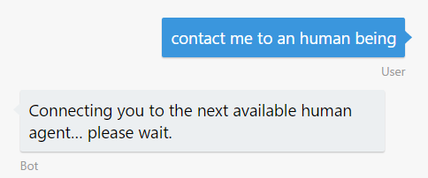
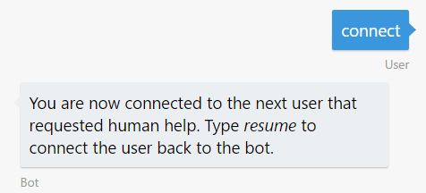
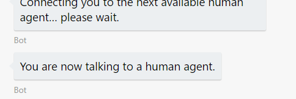
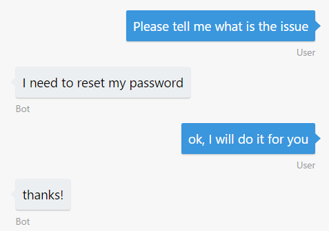
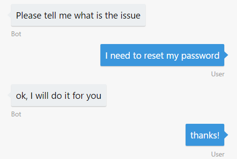
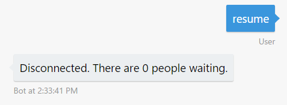
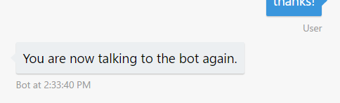

# Exercise 7: Hand off the conversation to a human agent (Node.js)

## Introduction

In this exercise, you will learn how to hand off a conversation to a human agent.

First, you will learn how to create a middleware to intercepts incoming and outgoing events/messages. In this middleware you will handle the user-agent communication and the specials command only available for agents. Later you will modify your bot to use the new middleware and add a dialog to enter as a human agent.

Inside [this folder](./exercise7-HandOffToHuman) you will find a solution with the code that results from completing the steps in this exercise. You can use this solution as guidance if you need additional help as you work through this exercise. Remember that for using it, you first need to run `npm install`.

## Prerequisites

The following software is required for completing this exercise:

* [Latest Node.js with NPM](https://nodejs.org/en/download/)
* A code editor like [Visual Studio Code](https://code.visualstudio.com/download) or Visual Studio 2017 Community, Professional, or Enterprise
* An Azure Subscription - you can sign up for a free trial [here](https://azureinfo.microsoft.com/us-freetrial.html?cr_cc=200744395&wt.mc_id=usdx_evan_events_reg_dev_0_iottour_0_0)
* The Bot Framework Emulator - download it from [here](https://emulator.botframework.com/)
* An account in the LUIS Portal [here](https://www.luis.ai)

## Task 1: Build the Hand-off Logic

In this task you will add the necessary _behind-the-scene_ logic to handle the bridged communication between two persons, one as a user and other as an agent. You will learn how to create and put a middleware to intercepts incoming and outgoing events/messages.

The middleware functionality in the Bot Builder SDK enables your bot to intercept all messages that are exchanged between user and bot. For each message that is intercepted, you may choose to do things such as save the message to a data store that you specify, which creates a conversation log, or inspect the message in some way and take whatever action your code specifies. For more information about middleware refer to [this link](https://docs.microsoft.com/en-us/bot-framework/nodejs/bot-builder-nodejs-intercept-messages).

1. Copy the folder [handoff](../assets/handoff) from the assets. Inside you will find two files:

    * [`provider.js`](../assets/handoff/provider.js) which builds a queue with the users waiting for a human agent. Notice that this module does not persist the queue.

    * [`command.js`](../assets/handoff/command.js) to handle the special interaction between the agent and the bot to peek a waiting user to talk or to resume a conversation. This module has a [middleware](../assets/handoff/command.js#L9) that intercepts messages from human agents and route them to the options to connect or resume communications with users.

1. Create the `router.js` file. Using the following "structure". You will use this to handle the conversation between normal users and agents.

    ```javascript    
    const builder = require('botbuilder');
    const { Provider, ConversationState } = require('./provider');

    function Router(bot, isAgent) {
        'use strict';

        const provider = new Provider();

        const pending = () => {
            return provider.currentConversations().filter((conv) => conv.state === ConversationState.WaitingForAgent).length;
        };

        return {
            isAgent,
            middleware,
            pending,
            provider,
            bot
        };
    }

    module.exports = Router;
    ```

1. Add `middleware` method in `router.js`. This method decides if route the incoming message to be handled as a human agent message or a normal user message.

    ```javascript
    const middleware = () => {
        return {
            botbuilder: (session, next) => {
                if (session.message.type === 'message') {
                    if (isAgent(session)) {
                        routeAgentMessage(session);
                    } else {
                        routeUserMessage(session, next);
                    }
                } else {
                    next();
                }
            }
        };
    };
    ```

1. Add `routeAgentMessage` method in `router.js`. This method route the message from the human agent to the user if the agent is in conversation.

    ```javascript
    const routeAgentMessage = (session) => {
        const message = session.message;
        const conversation = provider.findByAgentId(message.address.conversation.id);

        if (!conversation) {
            return;
        }

        bot.send(new builder.Message().address(conversation.user).text(message.text));
    };
    ```

1. Add `routeUserMessage` method in `router.js`. If the incoming message is from a normal user, this method retrieves (or create) the conversation's info and use the `conversation.state` to decides if it continues the normal bot flow, send a message to the user informing the status of the queue or route the user's message to the human agent.

    ```javascript
    const routeUserMessage = (session, next) => {
        const message = session.message;

        const conversation = provider.findByConversationId(message.address.conversation.id) || provider.createConversation(message.address);

        switch (conversation.state) {
            case ConversationState.ConnectedToBot:
                return next();
            case ConversationState.WaitingForAgent:
                session.send(`Connecting you to the next available human agent... please wait, there are ${pending()-1} users waiting.`);
                return;
            case ConversationState.ConnectedToAgent:
                bot.send(new builder.Message().address(conversation.agent).text(message.text));
                return;
        }
    };
    ```
Now, you have the modules to support the user-to-agent communication.

## Task 2: Update the Bot to make the Handoff

In this task you will update the bot to connect the previous routing middleware and add the dialogs to use it.

1. Navigate to the [LUIS Portal](https://www.luis.ai) and edit your app to add **HandOffToHuman** intent with the following utterances:
    * I want to talk to an it representative
    * Contact me to a human being

    If you prefer, you can import and use [this LUIS model](./exercise7-HandOffToHuman/data/HelpDeskBot-Exercise7.json).

1. Open the **app.js** file you've obtained from exercise 6. Alternatively, you can use the file from the [exercise6-MoodDetection](./exercise6-MoodDetection/) folder.

1. Create the middleware like follows: 

    ```javascript
    const handOffRouter = new HandOffRouter(bot, (session) => {
        return session.conversationData.isAgent;
    });
    const handOffCommand = new HandOffCommand(handOffRouter);
    ```

1. Connect each middleware to the bot

    ```javascript
    bot.use(handOffCommand.middleware());
    bot.use(handOffRouter.middleware());
    ```

1. Add the `AgentMenu` dialog to convert a user to a human agent.

    ```javascript
    bot.dialog('AgentMenu', [
        (session, args) => {
            session.conversationData.isAgent = true;
            session.endDialog(`Welcome back human agent, there are ${handOffRouter.pending()} waiting users in the queue.\n\nType _agent help_ for more details.`);
        }
    ]).triggerAction({
        matches: /^\/elevate me/
    });
    ```

    >NOTE: This way to register an agent do not have any protection or authentication method and it's used here to keep it as simple as possible. 

1. Add the dialog to put the user in the queue to talk to an agent.

    ```javascript
    bot.dialog('HandOff',
        (session, args, next) => {
            if (handOffCommand.queueMe(session)) {
                var waitingPeople = handOffRouter.pending() > 1 ? `, there are ${handOffRouter.pending()-1} people waiting` : '';
                session.send(`Connecting you to the next available human agent... please wait${waitingPeople}.`);
            }
            session.endDialog();
        }
    ).triggerAction({
        matches: 'HandOffToHuman'
    });
    ```

1. Update `UserFeedbackRequest` dialog to call the Handoff dialog created in the previous step if the user satisfaction score is bellow 0.5.

    ```javascript
    bot.dialog('UserFeedbackRequest', [
        (session, args) => {
            builder.Prompts.text(session, 'How would you rate my help?');
        },
        (session, args) => {
            const answer = session.message.text;
            analyzeText(answer, (err, score) => {
                if (err) {
                    session.endDialog('Ooops! Something went wrong while analyzing your answer. An IT representative agent will get in touch with you to follow up soon.');
                } else {
                    // 1 - positive feeling / 0 - negative feeling
                    if (score < 0.5) {
                        builder.Prompts.confirm(session, 'Do you want me to escalate this with an IT representative?');
                    } else {
                        session.endDialog('Thanks for sharing your experience.');
                    }
                }
            });
        },
        (session, args) => {
            if (args.response) {
                session.replaceDialog('HandOff');
            } else {
                session.endDialog();
            }
        }
    ]);
    ```

## Task 3: Test the Bot from the Emulator

1. Run the app from a console (`node app.js`) and open two instances of the emulator. Type the bot URL as usual (`http://localhost:3978?api?messages`) in both.

1. In one emulator type `contact me to an human being` to send the user to the queue of waiting users.

    

1. In the second emulator type `/elevate me` to take control of the agent privileges. The bot should inform you that there are one user waiting.

    

1. Again, in the second emulator type `connect` to begin the conversation with the user. Note that in the first emulator the bot will inform the user of this connection.

| Agent messages | User messages |
|---|---|
|||

1. Now you can play with the emulators and see the communication between agent and user.

| Agent messages | User messages |
|---|---|
|  |  |

1. In order to finish the interaction type `resume` in the second emulator (the agent emulator) and the bot should inform to both participants the end of communication.

| Agent messages | User messages |
|---|---|
|||

## Further Challenges

If you want to continue working on your own you can try with these tasks:

* Add authentication for the `AgentMenu` dialog. You would need to add [Sign-inCard](https://docs.botframework.com/en-us/node/builder/chat-reference/classes/_botbuilder_d_.signincard.html) to invoke your user's authentication process.
* Modify the [`provider.js`](../assets/handoff/provider.js#L13) to add conversation data persistence.

