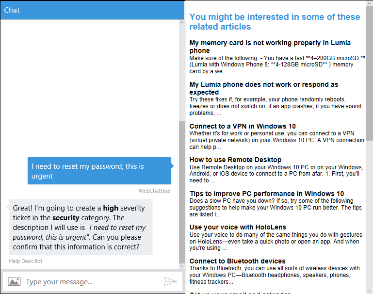
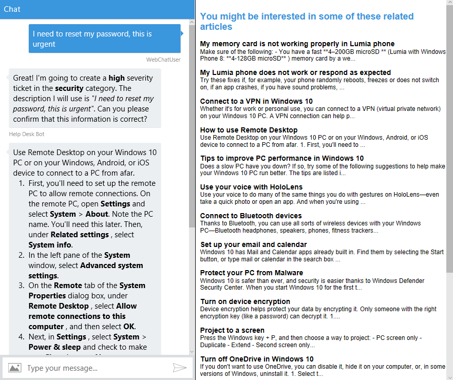

# Exercise 8: Send and Receive Events Through a Backchannel (Node.js)

## Introduction

The [open source Web Chat Control](https://github.com/Microsoft/BotFramework-WebChat) communicates with bots by using the [Direct Line API](https://docs.botframework.com/en-us/restapi/directline3/#navtitle), which allows `activities` to be sent back and forth between client and bot. The most common type of activity is `message`, but there are other types as well. For example, the activity type `typing` indicates that a user is typing or that the bot is working to compile a response.

You can use the backchannel mechanism to exchange information between client and bot without presenting it to the user by setting the activity type to `event`. The web chat control will automatically ignore any activities where `type="event"`.

Essentially the backchannel allows client and server to exchange any data needed, from requesting the client's time zone to reading a GPS location or what the user is doing on a web page. The bot can even guide the user by automatically filling out parts of a form and so on. The backchannel closes the gap between client JavaScript and bots.

In this exercise, the bot and web page will use the backchannel mechanism to exchange information that is invisible to the user. The bot will request that the web page show the knowledge base search results, and the web page will request that the bot show the detail of an article.

Inside [this folder](./exercise8-BackChannel) you will find a solution with the code that results from completing the steps in this exercise. You can use this solutions as guidance if you need additional help as you work through this exercise. Remember that for using it, you first need to run `npm install` and complete the placeholders of the **Web Chat Channel Secrets**.

If you are not following all the exercises maybe you don't have already register your bot. To know how to register your bot, please refer to the [Exercise 5](./exercise5-Deployment.md).

## Prerequisites

The following software is required for completing this exercise:

* [Latest Node.js with NPM](https://nodejs.org/en/download/)
* A code editor like [Visual Studio Code](https://code.visualstudio.com/download) (preferred), or Visual Studio 2017 Community or higher
* The [Bot Framework Emulator](https://emulator.botframework.com) (make sure it's configured with the `en-US` Locale)
* [ngrok](https://ngrok.com/)

## Task 1: Add a New Site to Your Bot's Web Chat Channel

1. Sign in to the [Bot Framework Portal](https://dev.botframework.com).

1. Click the **My bots** button and next click on your bot for editing it.

1. Click on the **Edit** () link for the _Web Chat_ channel. In the opened window, click **Add new site**. Enter a _site name_ (for example, _Help Desk Ticket Search_), Site name is for your reference and you can change it anytime.

    

1. Click **Done** and you may see a page as follow. Notice you have two **Secret Keys**. Safe for late use one of them. Click the **Done** button at page bottom.

    

## Task 2: Add HTML Page with an Embedded Web Chat

In this task you will add a HTML page to your server which contains the **Web Chat Control**. Next, you will add the BackChannel capability to send `event` activities from your bot to the Web Page.

1. Create a new folder named `web-ui` in the root folder for your solution. In that folder, copy the [default.htm](../assets/exercise8-BackChannel/default.htm) file.

1. Bellow the [`botchat.js` script element](../assets/exercise8-BackChannel/default.htm#L52) add a new script element with the following code boilerplate which creates a **DirectLine** object with the **Web Channel Secret**. Replace the `DIRECTLINE_SECRET` placeholder with your Secret Key previously obtained and the `BOT_ID` placeholder with the ID from your bot.

    ``` html
    <script>
        var botConnection = new BotChat.DirectLine({
            secret: 'DIRECTLINE_SECRET'
        });
        var resPanel = document.getElementById('results');

        BotChat.App({
            botConnection: botConnection,
            user: { id: 'WebChatUser' },
            bot: { id: 'BOT_ID' },
            locale: 'en-us',
        }, document.getElementById("bot"));
    </script>
    ```

1. Add the `searchResults` method to catch incoming `event` activities and show the article list which comes in the value's activity.

    ``` javascript
    botConnection.activity$
        .filter(function (activity) {
            return activity.type === 'event' && activity.name === 'searchResults';
        })
        .subscribe(function (activity) {
            updateSearchResults(activity.value)
        });

    function updateSearchResults(results) {
        resPanel.innerHTML = ''; // clear
        results.forEach(function (result) {
            resPanel.appendChild(createSearchResult(result));
        });
    }

    function createSearchResult(result) {
        var el = document.createElement('div');
        el.innerHTML = '<h3>' + result.Title + '</h3>' +
            '<p>' + result.Text.substring(0, 140) + '...</p>';

        return el;
    }
    ```

## Task 3: Update your Bot to Send `event` Activities

1. Open the **app.js** in the root folder. Add the following `require` statement in the require section.

    ``` javascript
    const path = require('path');
    ```

1. Adobe the `var bot = new builder.UniversalBot(...);`, add the following code which tells _Restify_ to serve the `web-ui/default.htm` file as the default web page.

    ``` javascript
    server.get(/\/?.*/, restify.serveStatic({
        directory: path.join(__dirname, 'web-ui'),
        default: 'default.htm'
    }));
    ```

1. In the first step on the waterfall for the **SubmitTicket** dialog, just below where you store the message in the `session.dialogData.description` add the following code to search the **Knowledge Base** and send an `event` activity with the result to the Web Page.

    ``` javascript
    azureSearchQuery(`search=${encodeURIComponent(session.message.text)}`, (err, result) => {
        if (err || !result.value) return;
        var event = createEvent('searchResults', result.value, session.message.address);
        session.send(event);
    });
    ```

1. Add the `createEvent` function as follows. This build a message with type `event` and the article list as the value.

    ``` javascript
    const createEvent = (eventName, value, address) => {
        var msg = new builder.Message().address(address);
        msg.data.type = `event`;
        msg.data.name = eventName;
        msg.data.value = value;
        return msg;
    };
    ```

## Task 4: Test Back channel from Bot to Web Page

1. Run the app from a console (`nodemon app.js`).

1. Open a new console window where you've downloaded _ngrok_ and type `ngrok http 3978`. Notice that `3978` is the port number where your bot is running. Change if you are using another port number. Next, save for later use the Forwarding **https** URL.

    

    > **NOTE:** ngrok allows you to expose a web server running on your local machine to the internet. Just tell ngrok what port your web server is listening on. When you start it will display an UI in your terminal with the public URL of your tunnel and other status and metrics information about connections made over your tunnel.

1. Sign in to the [Bot Framework Portal](https://dev.botframework.com).

1. Click the **My bots** button and next click on your bot for editing it. Click on the **Settings** tab and update the _Messaging endpoint_ URL (remember to keep the `/api/messages`). Click in the **Save changes** button.

1. In a Web Browser, navigate to your bot URL (http://localhost:3978/ as usual). On the Web Chat Control, type `I need to reset my password, this is urgent`. You should see the ticket confirmation message as usual in the Web Chat Control. You must see the article list in the right is populated based on the description you entered.

    

## Task 5: Update Web Page to Send `event` Messages to Your Bot

1. Open the **default.htm** file in the root folder for your solution. In the style section, replace the `#results h3` selector with the following CSS:

    ``` css
    #results h3 {
        margin-top: 0;
        margin-bottom: 0;
        cursor: pointer;
    }
    ```

1. Update the `createSearchResult` function with the following code which add a new event that post a `event` activity to the bot when user clicks on the **Title** of any article.

    ```javascript
    function createSearchResult(result) {
        var el = document.createElement('div');
        el.innerHTML = '<h3>' + result.Title + '</h3>' +
            '<p>' + result.Text.substring(0, 140) + '...</p>';

        el.getElementsByTagName('h3')[0]
            .addEventListener('click', function () {
                botConnection
                    .postActivity({
                        type: 'event',
                        value: this.textContent.trim(),
                        from: { id: 'user' },
                        name: 'showDetailsOf'
                    })
                    .subscribe(function (id) {
                        console.log('event sent', id);
                    });
            });

        return el;
    }
    ```

## Task 6: Update Your Bot to intercept `event` activity

1. Open the **app.js** file and add the following event listener registration which will be called when user clicks in an article's title. This method will search for article's titles in the **Knowledge Base** with the string requested and then send the result to user in the **Web Chat Control**. Click [here](https://docs.botframework.com/en-us/node/builder/chat-reference/classes/_botbuilder_d_.universalbot.html#on) for more information about the `on` event listener.

    ``` javascript
    bot.on(`event`, function (event) {
        var msg = new builder.Message().address(event.address);
        msg.data.textLocale = 'en-us';
        if (event.name === 'showDetailsOf') {
            azureSearchQuery('$filter=' + encodeURIComponent(`title eq '${event.value}'`), (error, result) => {
                if (error || !result.value[0]) {
                    msg.data.text = 'Sorry, I could not find that article.';
                } else {
                    msg.data.text = result.value[0].text;
                }
                bot.send(msg);
            });
        }
    });
    ```

## Task 7: Test the Bot from the Web Page

1. Run the app from a console (`nodemon app.js`). Check if **ngrok** is still running. Otherwise, run it and update your Bot Configuration like described in Task 4.

1. In a Web Browser, navigate to your bot URL (http://localhost:3978/ as usual). On the **Web Chat Control**, type `I need to reset my password, this is urgent`.

    

1. Click on the title of any of the articles on the right and next you should see the details of the article displayed in the bot **Web Chat Control**.

    
