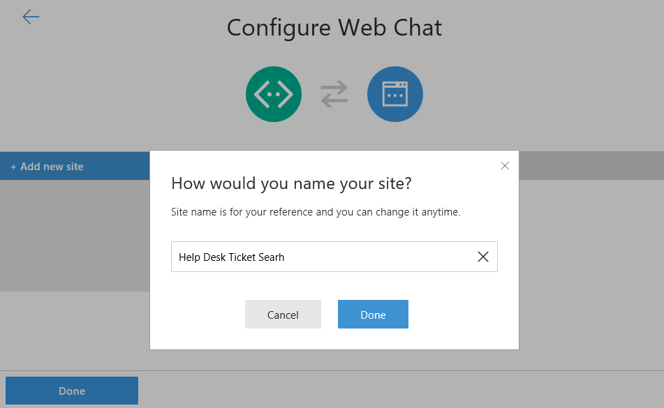

# Exercise 8: Send and receive events through Back Channel (Node.js)

## Introduction

Your bot receives messages from the user but it can also receives events from the client code. This is very handful to send data to your bot backend code without the user knowing it. In the web chat control it is called the backchannel.

WebChat and/or the page can send and/or receive activities. If they are type 'event', WebChat will not display them. This is how the backchannel works.

Essentially the backchannel allows client and server to exchange any data needed, from requesting the client's time zone to reading a GPS location or what the user is doing on a web page. The bot can even "guide" the user by automatically filling out parts of a form and so on. The backchannel closes the gap between client JavaScript and bots.

In this exercise you will learn how to implement a bidirectional backchannel on a web page to search the knowledge base based on the problem described by user and show result articles in a section of the page. We will use the Web Chat instead the Emulator channel for this Exercise for simplicity purposes.

Inside [this folder](./exercise8-BackChannel) you will find a solution with the code that results from completing the steps in this exercise. You can use this solutions as guidance if you need additional help as you work through this exercise. Remember that for using it, you first need to run `npm install` and complete the placeholders of the Web Chat Channel Secrets.

If you are not following all the exercises maybe you don't have already register your bot. To know how to

## Prerequisites

The following software is required for completing this exercise:

* [Latest Node.js with NPM](https://nodejs.org/en/download/)
* A code editor like [Visual Studio Code](https://code.visualstudio.com/download) (preferred), or Visual Studio 2017 Community or higher
* The [Bot Framework Emulator](https://emulator.botframework.com) (make sure it's configured with the `en-US` Locale)
* Download [ngrok](https://ngrok.com/)

## Task 1: Add a New Site to your Bot's Web Chat Channel

In this task you will add a new site to your Web Chat Channel to use later.

1. Sign in to the [Bot Framework Portal](https://dev.botframework.com).

1. Click the **My bots** button and next click on your bot for editing it.

1. Click on the **Edit** () link for the _Web Chat_ channel. In the opened window, click **Add new site**. Enter a _site name_ (for example, _Help Desk Ticket Search_), Site name is for your reference and you can change it anytime.

    

1. click **Done** and you may see a page as follow. Notice you have two Secret Keys. Safe for later use one of then. Click the **Done** button at page bottom.

    

## Task 2: Add HTML Page with an Embedded Web Chat

In this task you will add a HTML page to your server which contains the web chat control and the code to send/receive 'event' messages to/from your bot.

1. Copy the folder [web-ui](../assets/web-ui) from the assets folder to the app. Inside you will find a _index.html_ file which contains the markup, style and code for the web page. The JavaScript code may be break down in these sections:

    * Import the latest `botchat.js` version from a CDN, so you don't need to worry about update or host it.

    * The web page creates a DirectLine object:

        ``` javascript
        var botConnection = new BotChat.DirectLine({
            secret: '{YourWebChannelSecret}'
        });
        ```

    * It shares this when creating the WebChat instance:

        ``` javascript
        BotChat.App({
            botConnection: botConnection,
            user: { id: 'WebChatUser' },
            bot: { id: '{YourBotID}' },
            locale: 'en-us',
        }, document.getElementById("bot"));
        ```

    * The client JavaScript listens for a specific event from the bot:

        ``` javascript
        botConnection.activity$
            .filter(function (activity) {
                return activity.type === 'event' && activity.name === 'searchResults';
            })
            .subscribe(function (activity) {
                updateSearchResults(activity.value)
            });
        ```

    * The `updateSearchResults` method parse the message sent from the bot and build the list of articles in the page and add a click event to the title element that post to the bot an event that tells to show the details of the article inside the Web Chat.

        ``` javascript
        ...
        botConnection
            .postActivity({
                type: 'event',
                value: this.textContent.trim(),
                from: { id: 'user' },
                name: 'showDetailsOf'
            });
        ...
        ```

1. Open the **index.html** file and replace the `{YourWebChannelSecret}` with the Web Chat secret you've obtained from the last task and `{YourBotID}` with the Id of your bot (if you don't remember, you can obtain from the Setting tab from your Bot Framework portal, under the _Bot handle_ field.)

## Task 3: Update your Bot to send and receive 'event' messages

In this task, you will add the ability to send and receive 'event' messages to your bot.

1. In the **app.js**, before the `var bot = new builder.UniversalBot(...);` add the following code which tells _Restify_ to serve the `web-ui/index.html` file.

    ``` javascript
    server.get(/\/?.*/, restify.serveStatic({
        directory: path.join(__dirname, 'web-ui'),
        default: 'index.html'
    }));
    ```

1. In the first step on the waterfall for the **SubmitTicket** dialog, add just before where you store the message in the `dialogData.description` the code below to send a event with the search result to the web page.

    ``` javascript
    // backchannel azure search
    azureSearchQuery(`search=${encodeURIComponent(session.message.text)}`, (err, result) => {
        if (err || !result.value) return;
        var event = createEvent('searchResults', result.value, session.message.address);
        session.send(event);
    });
    ```

1. Add the `createEvent` as follows. This method build a message with `event` as type and eventName for the case you wish to implement others 'event' messages.

    ``` javascript
    const createEvent = (eventName, value, address) => {
        var msg = new builder.Message().address(address);
        msg.data.type = 'event';
        msg.data.name = eventName;
        msg.data.value = value;
        return msg;
    };
    ```

1. Add the following code event listener registration which will triggered when the user clicks in an article's title. This method will show the user the articles with the same title picked up, in the Web Chat. Click [here](https://docs.botframework.com/en-us/node/builder/chat-reference/classes/_botbuilder_d_.universalbot.html#on) for more information about the `on` event listener.

    ``` javascript
    bot.on('event', function (event) {
        var msg = new builder.Message().address(event.address);
        msg.data.textLocale = 'en-us';
        if (event.name === 'showDetailsOf') {
            azureSearchQuery('$filter=' + encodeURIComponent(`title eq '${event.value}'`), (error, result) => {
                if (error || !result.value[0]) {
                    msg.data.text = 'Sorry, I could not find that article.';
                } else {
                    msg.data.text = result.value[0].text;
                }
                bot.send(msg);
            });
        }
    });
    ```

## Task 4: Test the Bot from the Web Page

1. Run the app from a console (`nodemon app.js`).

1. Open a new console window where you've downloaded _ngrok_ and type `ngrok http 3978`. Notice that `3978` is the port where your bot is running. Change if you are using another. Next, save for later use the Forwarding **https**.

    


1. Sign in to the [Bot Framework Portal](https://dev.botframework.com).

1. Click the **My bots** button and next click on your bot for editing it. Click on the **Settings** tab and change the _Messaging endpoint_ URL (remember to keep the `/api/messages`). Click in the **Save changes** button.

1. Navigate to your bot URL (http://localhost:3978/ as usual). You should see the Web Chat component and an empty list of articles.

1. On the Web Chat component, type `I need to reset my password, this is urgent` and you should see the ticket confirmation as usual in the Web Chat Component. Notice the article list is populated based on the description entered.

    exercise8-webchatarticles

---
1. Dev Bot portal
    1. Add web channel to the bot. Copy secret.

1. HTML
    1. Copy the web-ui\index.html.
    1. Update the html with the secret and bot id.

1. App.js:
    1. add //serve static content
    1. In SubmitTicket dialog add //backchannel azure search.
    1. Add createEvent method.
    1. Implement `Event` handler for listening inbound events.