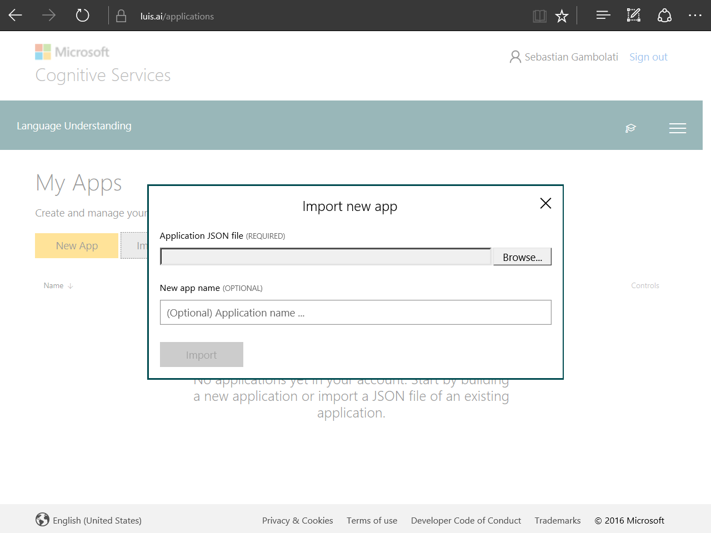

# Scenario 3: Making the Bot Smarter with Language Understanding - LUIS (Node.js)

## Introduction

In this hands-on lab you will learn how to add natural language understanding abilities to the bot to enhance the user experience when creating a help desk ticket. Throughout this lab you will use LUIS (Language Understanding Intelligent Services), which is part of the Azure Cognitive Services offering.  LUIS is designed to enable developers to build smart applications that can understand human language and accordingly react to user requests.

One of the key problems in human-computer interactions is the ability of the computer to understand what a person wants. LUIS is designed to enable developers to build smart applications that can understand human language and accordingly react to user requests. With LUIS, a developer can quickly deploy an HTTP endpoint that will take the sentences sent to it and interpret them in terms of their intents (the intentions they convey) and entities (key information relevant to the intent). 

Inside [this folder](./step3-TicketSubmissionDialog) you will find a solution with the code that results from completing the steps in this hands-on lab. You can use this solutions as guidance if you need additional help as you work through this hands-on lab. Remember that for using it, you first need to run `npm install`.

## Prerequisites

The following software is required for completing this hands-on lab:

* [Node.js LTS version with NPM](https://nodejs.org/en/download/)
* A code editor like [Visual Studio Code](https://code.visualstudio.com/download)
* An Azure Subscription - you can signup for a free trial [here](https://azure.microsoft.com/free/)
* Creating an account in the LUIS Portal [here](https://www.luis.ai)

## Task 1: Import LUIS
In this task you will import the given LUIS model into it portal to train and publish the LUIS app.

1. Navigate to [LUIS Portal](https://www.luis.ai) and sign in or create an account.
1. Navigate to the section **My apps** if you were not already there. Click on the **Import App** button and you must see a window like the following.

1. Browse for data\luis_model.json file and click on Import. After this you must see the application dashboard indicating there is two [intents](https://docs.microsoft.com/en-us/azure/cognitive-services/LUIS/add-intents) (None and SubmitTicket), two [entities](https://docs.microsoft.com/en-us/azure/cognitive-services/LUIS/add-entities) (category and severity) and fourteen [utterances](https://docs.microsoft.com/en-us/azure/cognitive-services/LUIS/add-example-utterances).

1. Now, you can go to **Publish App**. Before you can publish your LUIS's app you must [train](https://docs.microsoft.com/en-us/azure/cognitive-services/LUIS/train-test) it. For that click in the Train button and after a few seconds a confirmation message will appeas on the top of the page. After that, we can select a [Endpoint key](https://docs.microsoft.com/en-us/azure/cognitive-services/LUIS/manage-keys) (BoostrapKey is created by default when you signed in) and click **Publish** button. After a new confirmation message appears, the LUIS's app is now published. Copy and save for late use the *Endpoint url*.

## Task 2: Instanciate LUIS recognizer
In this task you will make reference to the previously LUIS app created *Endpoint url* into the bot code. And add the LuisRecognizer to pipeline.

1. With the copied *Endpoint url* define a constant named luisModelUrl as follow:
```javascript
const luisModelUrl = process.env.LUIS_MODEL_URL || 'YourEndpointURL';
```
Replace the string ```YourEndpointURL``` with the *Endpoint url* you copied earlier.

2. Add the LuisRecognizer into your bot by adding this line after the bot initialization and after the constant definition.
```javascript
bot.recognizer(new builder.LuisRecognizer(luisModelUrl));
```

### Refactor the waterfall dialog into a new dialog.
In this task you will refactor the waterfall steps into new dialogs that will be triggered by the LUIS intents.

1. **TBD** With the first waterfall step, create a new dialog called ```help```.
```javascript
bot.dialog('help', 
    (session, args, next) => {
        session.send('Hi! I\'m the help desk bot and I can help you create a ticket.');
        builder.Prompts.text(session, 'First, please briefly describe your problem to me.');
    }).triggerAction({
    matches: 'help'
});
```

2. Register a new dialog named ```SubmitTicket``` just before the line added with the ```LuisRecognizer```. Note that the name of the dialog must coincide with the Intents name in Luis app. Like the bot initialization, we can pass to the dialog the existing waterfall. Move the waterfall step in which the bot ask for severity, category and confirm the data entered and the last one which hit the ticket API.
You must have a similiar code block as follow.

```javascript
bot.dialog('SubmitTicket', [
    (session, result, next) => {
        session.dialogData.description = result.response;

        var choices = ['high', 'normal', 'low'];
        builder.Prompts.choice(session, 'Which is the severity of this problem?', choices);
    },
    (session, result, next) => {
        session.dialogData.severity = result.response.entity;

        builder.Prompts.text(session, 'Which would be the category for this ticket (software, hardware, network, and so on)?');
    },
    (session, result, next) => {
        session.dialogData.category = result.response;

        var message = `Great! I'm going to create a **${session.dialogData.severity}** severity ticket in the **${session.dialogData.category}** category. ` +
                      `The description I will use is _"${session.dialogData.description}"_. Can you please confirm that this information is correct?`;

        builder.Prompts.confirm(session, message);
    },
    (session, result, next) => {

        if (result.response) {
            var data = {
                category: session.dialogData.category,
                severity: session.dialogData.severity,
                description: session.dialogData.description,
            }

            const client = restify.createJsonClient({ url: `http://localhost:${listenPort}` });

            client.post('/api/tickets', data, (err, request, response, ticketId) => {
                if (err || ticketId == -1) {
                    session.send('Something went wrong while I was saving your ticket. Please try again later.')
                } else {
                    session.send(`Awesome! Your ticked has been created with the number ${ticketId}.`);
                }

                session.endDialog();
            });
        } else {
            session.endDialog('Ok. The ticket was not created. You can start again if you want.');
        }
    }
]);
```

3. Now, we will do some tweak in the code. First, we will retrieve the entities values for *category* and *severity* from LUIS and the message sent from the user and then and store in the ```dialogData``` for later use. Finally, if the severity is already setted, we call the next step otherwise prompt the user to choice one.
Replace the first waterfall step with the following code.

```javascript
    ...
    (session, args, next) => {
        var category = builder.EntityRecognizer.findEntity(args.intent.entities, 'category');
        var severity = builder.EntityRecognizer.findEntity(args.intent.entities, 'severity');

        if (category && category.resolution.values.length > 0) {
            session.dialogData.category = category.resolution.values[0];
        }

        if (severity && severity.resolution.values.length > 0) {
            session.dialogData.severity = severity.resolution.values[0];
        }

        session.dialogData.description = session.message.text;

        if (!session.dialogData.severity) {
            var choices = ['high', 'normal', 'low'];
            builder.Prompts.choice(session, 'Which is the severity of this problem?', choices);
        } else {
            next();
        }
    },
    ...
```
> **NOTE:** Notice that we changed the parameter *result* to *args*.

4. Update the second waterfall step to take care of receiving and store the severity of the ticket. If we already have a category we call the next step, otherwise we prompt the user to enter it.
```javascript
    ...
    (session, result, next) => {
        if (!session.dialogData.severity) {
            session.dialogData.severity = result.response.entity;
        }

        if (!session.dialogData.category) {
            builder.Prompts.text(session, 'Which would be the category for this ticket (software, hardware, network, and so on)?');
        } else {
            next();
        }
    },
    ...
```
5. Append the ```triggerAction``` clause to the *SubmitTicket* dialog.
```javascript
.triggerAction({
    matches: 'SubmitTicket'
});
```

6. Finally, insert a default message in the bot initialization. This message will be send to the user when others dialog doesn't match. For this, replace the bot initialization with the code below.
```javascript
var bot = new builder.UniversalBot(connector, (session) => {
    session.send(`I'm sorry, I did not understand '${session.message.text}'. I'm the help desk bot and I can help you create a ticket. You can tell me things like _I need to reset my password_ or _I cannot print_.`);
});
```
