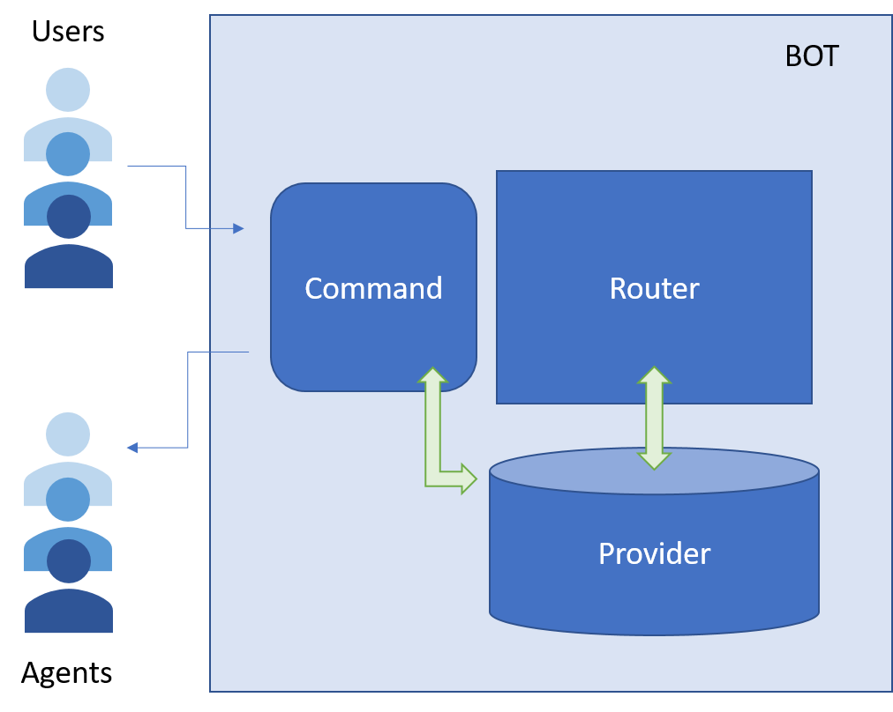
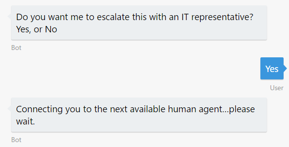

# Exercise 7: Hand off the Conversation to a Human Agent

Regardless of how much artificial intelligence a bot possesses, there may still be times when it needs to hand off the conversation to a human being. For example you want to build a bot that automatically replies some questions and is able to meet your customers wherever they are, but still be able to escalate issues to a human. Or if the bot couldn't handle every situation, or there were edge cases, the bot should be able to pass off to a person who had the right authority. The bot should recognize when it needs to hand off and provide the user with a clear, smooth transition. In this exercise, you will learn how you can use a bot to initiate a conversation with a user, and then hand off context to a human agent.

The handoff bot pattern is further explained in this [article](https://docs.microsoft.com/en-us/bot-framework/bot-design-pattern-handoff-human).

Inside these folders for either [C#](./CSharp/exercise7-HandOffToHuman) or [Node.js](./Node/exercise7-HandOffToHuman) you will find a solution with the code that results from completing the steps in this exercise. You can use this solution as guidance if you need additional help as you work through this exercise.

This diagram outlines the components of the bot for this exercise:

## Goals

To successfully complete this exercise, your bot must be able to perform the following actions:

* When the bot asks for feedback after the creation of the ticket (from exercise 6), if the user sentiment is negative put him in a queue to talk to a human agent.
* When the bot receives a command with the text _"/agent login"_, mark that the conversation is from a human agent. After this happens, this user is able to:
    * Type _"connect"_ to connect to a human agent. In this state, all the messages that the agent types are forwarded to the user. The same happens the other way around. The bot is transformed in a "message forwarder".
    * Type _"help"_ to get the list of commands (optional).
    * Type _"resume"_ to disconnect from the user and talk back to the bot.

Here are some sample interactions with the bot:

| Agent messages | User messages |
|---|---|
|  |  |

## Prerequisites

* You must have either completed the prior exercise, or you can use the starting point provided for either [C#](./CSharp/exercise6-MoodDetection) or [Node.js](./Node/exercise6-MoodDetection)
* An account in the [LUIS Portal](https://www.luis.ai)
* An [Azure](https://azureinfo.microsoft.com/us-freetrial.html?cr_cc=200744395&wt.mc_id=usdx_evan_events_reg_dev_0_iottour_0_0) subscription

## Create and Configure the Azure Services

There are many different ways in which you can implement the bot dialogs. Here is a proposal for each language:

In Node.js add the following Dialogs:

* TBD

In C# add the following Dialogs and Scorables:

* TBD
